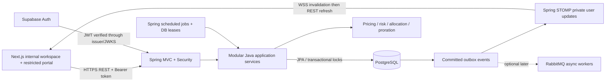

# DealFlow360 — End-to-End Implementation Plan

**Revision 2 • 5 September 2026 • Four developers • 24 hours**

**Confirmed team context:** practical Spring Boot experience. This edition replaces the proposed Next.js business backend with Spring Boot, adds authenticated WebSockets and an outbox, and incorporates all 23 submitted edge cases. RabbitMQ remains an explicitly optional later stage.

Companion: **DealFlow360 — Solution Report**. This plan defines proposed implementation decisions; it does not claim that an application has already been built, deployed, or tested.

## 1. Delivery contract

Build the entire required workflow with real calculations and persisted changes. Use modest forms and tables where necessary. There are three delivery classes:

- **R — Required:** explicitly required behavior from the PDF. It remains part of completion even if implementation falls behind.
- **D — Design decision:** our concrete interpretation where the brief is underspecified; configurable defaults are listed below.
- **I — Innovation:** extra functionality; implement after R passes.

Target scale for the hackathon: one company, INR, up to eight warehouses, 30 catalog variants, 100 customers, and 500 historical orders. These are design/test bounds, not measured capacity limits or hidden hardcoded answers. Hardware has integer quantities; seats have integer quantities; service quantity can be decimal. Mixed quotations may include monthly, quarterly, and yearly recurring lines.

At hour 20, remove I from active work if any R acceptance test fails. If R remains incomplete at submission, name the missing behavior honestly; a fallback is not equivalent to full compliance.

## 2. Stack, setup, and repository

### 2.1 Selected stack and deployment shape

| Concern | Selection | Constraint |
|---|---|---|
| Frontend | Next.js 16, React, TypeScript; Node 24 LTS target | UI only; no duplicate authoritative business backend |
| Backend | Java 21, patched Spring Boot 4.1.x, Spring MVC | One modular backend process and database |
| Design/forms | Tailwind, shadcn/ui, React Hook Form, Zod | Client validation complements Java validation |
| API contract | Versioned OpenAPI YAML; generated TypeScript DTOs | Java controller DTOs and contract tests must agree |
| Identity | Supabase Auth + Spring Security OAuth2 Resource Server | Verify signature, issuer, expiry and audience; read stored role |
| Database | Supabase PostgreSQL, JPA/Hibernate, HikariCP, Flyway | DTO projections, explicit transactions and locks |
| Money/dates | Java BigDecimal, java.time; BIGINT minor units in DB | Server calculates; JSON amounts are decimal strings |
| Live UI | Spring WebSocket/STOMP and `@stomp/stompjs` | Private per-user events after commit; REST refetch |
| Client fetching | TanStack Query | Invalidation on events, full refresh on reconnect, 5-second fallback |
| Reports | Recharts UI, Apache PDFBox, Apache POI backend | Server-authorized PDF and genuine XLS/XLSX |
| Tests | Spring Boot Test/JUnit, Testcontainers PostgreSQL, Playwright | Java rules, actual DB races, browser and WebSocket security |
| Jobs | Spring scheduler, persisted leases, database outbox | Independent of browser; catch up after restart |
| Hosting | Vercel frontend; persistent Spring container on Railway; Supabase | Separate frontend/backend deploy; HTTPS/WSS |
| Optional later | Spring AMQP + RabbitMQ | Async notifications/exports/integrations, not synchronous core gates |

The team has confirmed Spring experience, so this is the selected path. If an existing tested supported Spring baseline differs, pin it consistently rather than undertaking a major migration during the event. Boot's dependency management chooses compatible Spring/Hibernate components. The checked Boot requirements support Java 21. [Boot requirements](https://docs.spring.io/spring-boot/system-requirements.html)

Keep REST commands for approvals, counteroffers, payments, and stock mutations. WebSockets deliver committed update notifications; a disconnected client can still use REST. No broker is required for the initial single-backend deployment.

### 2.2 Bootstrap — execute when implementation starts

Generate a Java 21 Maven project with Spring Initializr using a current patched stable Boot 4.1 release. Select Spring Web/MVC, Validation, Spring Security, OAuth2 Resource Server, Spring Data JPA, PostgreSQL Driver, Flyway, WebSocket, and Actuator. Add PostgreSQL support for Flyway if required by the generated version. Use the Maven wrapper and Boot-managed dependency versions. Add PDFBox, POI, PostgreSQL Testcontainers, and contract-testing dependencies; add Spring AMQP only in the optional messaging stage.

Place the generated application under `apps/api`. Create the frontend under `apps/web` with the following illustrative commands, run from the repository's `apps` directory. These have not been executed for this planning task.

```powershell
npx create-next-app@16 web --ts --tailwind --eslint --app --src-dir --use-npm
cd web
npm install @supabase/supabase-js @tanstack/react-query react-hook-form @hookform/resolvers zod @stomp/stompjs lucide-react recharts
npm install -D @playwright/test openapi-typescript
npx shadcn@latest init
npx shadcn@latest add button input label card table dialog tabs badge select textarea dropdown-menu sheet sonner
npx playwright install chromium
```

Commit the npm lockfile and Maven wrapper. Add frontend scripts for typecheck, lint, build, e2e, and generating DTOs from `contracts/openapi.yaml`. Backend verification uses `./mvnw verify` (`.\mvnw.cmd verify` in PowerShell), with integration-test configuration that actually starts PostgreSQL Testcontainers. Do not treat a skipped Docker-dependent test suite as passed.

Use Flyway numbered SQL migrations under the backend resources. Run migrations with a controlled migration credential; runtime credentials have narrower grants. Configure `spring.jpa.hibernate.ddl-auto=validate` and `spring.jpa.open-in-view=false`. Do not use schema auto-update as migration history.

### 2.3 Repository and module ownership

```text
apps/
  web/src/
    app/(auth)/login/ signup/
    app/(internal)/workspace/ admin/
    app/portal/                    # separate customer layout
    components/ui/
    features/quotes/ approvals/ fulfillment/ billing/ reports/
    lib/api/ auth/ websocket/
    generated/api-types.ts
  api/src/main/java/com/dealflow/
    auth/ catalog/ quotes/ approvals/ recommendations/
    fulfillment/ billing/ portal/ reporting/
    notifications/ outbox/ jobs/
    shared/money/ time/ errors/
  api/src/main/resources/
    application.yml
    db/migration/
  api/src/test/java/com/dealflow/
contracts/openapi.yaml
tests/e2e/
docs/
infra/Dockerfile.api
```

Organize Java packages by business module, with controller, application service, domain rule, repository, entity, and DTO classes inside each. Controllers validate and authorize; services orchestrate transactions; pure Java rules calculate outcomes without I/O. Do not return JPA entities directly from controllers. OpenAPI is the cross-language contract; there are no shared TypeScript domain functions on the backend.

### 2.4 What JPA does and does not solve

Use JPA repositories for mapping/CRUD and projections for reporting. Use `@Version` on mutable quote/approval aggregates and pessimistic write locks for scarce-stock/payment allocation rows. For aggregate locks, indexed native SQL can be clearer than a complicated entity graph. Keep lock acquisition order consistent. Add DB unique/check constraints; annotations alone cannot enforce every cross-row invariant. [JPA locking](https://docs.spring.io/spring-data/jpa/reference/jpa/locking.html)

Use HikariCP with an initial maximum pool of 5 per instance and bounded acquisition/statement timeouts. The total across replicas and maintenance tools must fit the actual database limit. Use a direct PostgreSQL connection where networking permits, or Supabase's **session** pooler for this persistent backend. Do not reuse the old serverless transaction-pooler configuration blindly. Keep TLS verification enabled. [Supabase connections](https://supabase.com/docs/guides/database/connecting-to-postgres)

JPA is not a guarantee against connection failure, N+1 queries, lazy-loading exceptions, lost updates, or overselling. Fetch required DTO data inside the intended transaction; page list queries; inspect SQL/query counts. Put `@Transactional` on externally invoked application-service methods, use REQUIRED propagation across core modules, and configure rollback for relevant checked exceptions. Avoid self-invocation assumptions, nested REQUIRES_NEW financial writes, and network calls while locks are held. [Spring transactionality](https://docs.spring.io/spring-data/jpa/reference/jpa/transactions.html)

## 3. Requirement coverage matrix

Owner letters refer to the work allocation in section 12. An acceptance item must be visibly demonstrated or verified by the linked test category; a rendered screen alone is insufficient.

| Brief requirement | Implementation | Owner | Acceptance evidence |
|---|---|---|---|
| A1 login/signup/portal identity | Supabase Auth, Spring JWT security, role profile | A | Signup defaults to Rep; customer cannot access internal APIs |
| A2 product/variant/pricelist | Product and variant forms; price by tier/currency | A | Changing tier/variant changes evaluated price |
| A3 discount/approval configuration | Versioned policy form and risk engine | A | Mixed-category quote routes to highest required step |
| A4 warehouse/replenishment setup | Stock rows, movements, reorder threshold/target, expected receipt | B | Stock receipt changes availability and backorder prompt |
| A5 recurring setup | Monthly/quarterly/yearly plans; change/cancel policies | C | Config changes alter future schedule/proration behavior |
| A6 optional recommendation setup | Basic promotion/margin settings; pairing UI optional | D | Required recommendations work without pairing UI |
| A7 reports/exports/filters | Real queries with period/rep/team/status/product/category | D | PDF and spreadsheet values match filtered records |
| B1 workspace navigation | Quotes, pipeline, reload, backend link, close workspace | A | Each action navigates or refreshes correctly |
| B2 list/pipeline | Quote cards plus status-derived columns | A | Mutations change list and pipeline state |
| B3 builder | Catalog/cart, quantities, line/order discounts, margin | A | Server recomputes; client cannot override prices |
| B4 approval screen | Sequential decisions and reasons, immutable audit events | A | Finance cannot precede Manager; revise invalidates approvals |
| B5 recommendation panel | Co-purchase scoring, promotions, add/dismiss, margin delta | D | Accepting suggestion creates an actual line and new totals |
| B6 split/override/backorder | Cost-aware allocation, accepted shortage policy, reservations, receipt/replan | B | Split two warehouses; reject oversell; consolidate remaining stock |
| B7 subscription/billing | One-time invoice, per-cadence recurring schedule, adjustments | C | Quantity and plan changes, cancellation, credit all calculate |
| B8 customer negotiation | Restricted DTO, comments, counteroffer, acceptance | D | Counter routes automatically; old acceptance cannot confirm new terms |
| B9 health/anomaly/nudge | Threshold alerts, fresh queries, durable notifications | D | Alert links to quote; nudge/escalation creates real task |
| Quick test payment | Recorded receipt, allocations, derived invoice status | C | Partial/full payments update outstanding and status |
| Deliverables | Seed, two 5-minute demo flows, one-page diagram, roadmap | All | Fresh setup instructions and reproducible test evidence |

## 4. Architecture and quality priorities



Priorities: correct commercial/financial state; role/ownership isolation; complete observable journeys; predictable UI; performance on the demo dataset. Browser calculations are previews only. Java evaluates every authoritative money/risk decision.

Transactional boundaries remain: submit/version quote; act on approval; adopt/accept candidate; finalize order; reserve/reallocate/dispatch stock; generate a charge; allocate payment/credit. Each change writes audit and outbox records in the same database transaction. An application-level coordinator calls modules in the same Spring transaction. This is why the baseline uses a modular monolith rather than microservices.

Events are dispatched only after commit. `@TransactionalEventListener(AFTER_COMMIT)` can trigger an immediate best-effort notification, but by itself cannot recover a crash between commit and send. A persisted outbox supplies recovery; a dispatcher retries with event IDs and aggregate versions. [Spring transaction-bound events](https://docs.spring.io/spring-framework/reference/data-access/transaction/event.html)

Keep private HTTP responses no-store. Partition frontend caches by user and clear on sign-out. Do not attach internal pricing information to portal responses or notification payloads. Customer ownership is checked in the Spring API, regardless of whether the frontend hid a control.

## 5. Data model and invariants

Use UUID IDs, `created_at`/`updated_at`, UTC timestamps, and explicit currency codes. Store commercial calendar dates as dates. Invoice references use a database sequence; UUID is the technical key. Foreign keys should normally RESTRICT deletion of commercial history; configuration is archived.

| Table/group | Essential fields and relationships |
|---|---|
| `profiles` | `auth_user_id`, role, team_id, customer_id nullable, is_active, unavailable_until; server-controlled mapping |
| `approval_delegations` | approver role/team, delegate, valid_from/until, reason, creator; only role-qualified substitutes |
| `teams`, `customers` | Name; customer tier, contact details, currency, owner rep; customer has many portal profiles |
| `categories`, `products` | Category; name, description, unit, base price/cost/currency/tax, fulfillment_kind STOCK/NONE, charge_kind ONE_TIME/RECURRING |
| `product_variants` | product_id, SKU, attributes JSON, price_extra_minor, cost_minor, substitution_group optional |
| `price_rules` | variant_id, tier, currency, unit_price_minor, priority, active dates; deterministic precedence |
| `discount_policies` | Immutable version JSON: tier/category ceilings, threshold ranges, floor margins, aggregate limits, effective_at |
| `warehouses`, `stock_levels` | Shipping fixed cost/weight; unique warehouse+variant, on_hand, reserved, reorder_point, target_qty, expected_receipt_date |
| `stock_movements` | variant, warehouse, signed quantity, RECEIPT/DISPATCH/ADJUSTMENT, reference, idempotency key |
| `subscription_plans` | interval_months in 1/3/12, interval_price_minor and interval_cost_minor, tax rate, proration/cancel policy, anchor convention |
| `quotes` | customer, rep/team, current_revision_id, stage, row_version, valid_until, last_activity_at, last_progress_at, awaiting_external_since |
| `quote_revisions` | quote_id, revision_no unique, source, currency, price/policy snapshots, risk result, commercial_hash, seller_adopted_at, customer_accepted_at; accepted backorder/invoice/bundle terms |
| `quote_lines` | revision_id, stable_line_key, variant/plan, qty, resolved price/cost/tax snapshots, line/order discount, totals |
| `approval_requests` | revision_id, step 1/2, role/team, optional assignee, due_at, status, actor, reason/time, row_version; unique revision+step |
| `negotiation_requests` | quote/revision, customer actor, line key optional, type COMMENT/CHANGE/COUNTER, payload, response/status |
| `orders`, `order_lines` | Unique originating quote; accepted revision, immutable line snapshots, order/fulfillment/billing statuses |
| `shipments`, `shipment_lines` | order, warehouse, status DRAFT/RESERVED/DISPATCHED; quantities linked to order lines |
| `reservations` | order_line, stock row, quantity, status; exactly tracks unshipped held stock |
| `backorders` | order_line, remaining quantity, expected date, status; no invented receipt date |
| `subscriptions` | order_line, customer, plan/discounted-price/cost/tax snapshots, quantity, anchor_day, period_start/end, status, next_bill_at |
| `subscription_changes` | subscription, effective_date, prior/new snapshots, type, adjustment references, unique request key |
| `invoices`, `invoice_lines` | customer/order, currency, status, due date; line amount/tax and coverage_start/end, source charge key unique |
| `payments`, `payment_allocations` | Amount, method/reference, recorded_at; allocation to invoice; allocations cannot exceed payment or outstanding |
| `credit_notes`, `credit_allocations`, `refunds` | Original invoice/coverage, reason, amount, applied balance, refund reference; no duplicate credit for same unused coverage |
| `recommendation_dismissals` | actor, quote revision, variant; dismissed recommendations remain dismissed for that revision |
| `alerts`, `notifications` | quote/order/subscription, type, reasons, OPEN/RESOLVED, dedupe key; nudge/escalation status |
| `audit_events` | actor, action, entity, revision, before/after summary, reason, timestamp, request ID; append-only to runtime role |
| `job_runs`, `idempotency_requests` | job/date cursor and lease; actor+operation+key, payload hash, saved result |
| `outbox_events` | event_id, aggregate_id/version, type, minimal payload, attempt_count, next_attempt_at, lease_until, dispatched_at |
| `processed_events` (optional RabbitMQ stage) | unique consumer+event_id; recorded with that consumer's business effect |

Promotion flag and minimum recommendation margin can live on products/settings. Purchase history for recommendation queries is derived from finalized order lines, not a second invented history source. Store relevant versioned configuration as JSON where it saves schema time, but validate it with Java DTO/Bean Validation and domain constraints before saving.

### 5.1 Database checks and indices

- Amounts persisted in minor units as BIGINT; quantity as NUMERIC where needed. Serialize BIGINT/NUMERIC as decimal strings in JSON to avoid precision loss.
- `on_hand >= 0`, `reserved >= 0`, `reserved <= on_hand`; quantity and valid recurring price are positive; discounts are 0–9,999 basis points; reject any discounted line rounding to zero net in this build.
- Unique order per quote; unique revision number; unique billing charge key; unique movement request key; unique actor+operation+idempotency key.
- Foreign keys for all commercial associations. Enforce customer consistency through service checks and compound foreign keys where practical.
- `period_end > period_start`; confirmed/issued amounts remain immutable. Correct them through a revision, adjustment, or credit rather than overwriting history.
- Index quotes by owner/stage/activity, approvals by role/status, stock by variant+warehouse, subscriptions by next_bill_at/status, invoices by customer/status/due_date, and alerts by status/type.
- Add optimistic `row_version` checks to mutable quote/configuration records. Return 409 if another user has edited the record.
- Validate balanced allocation quantities inside the locked transaction. A UI-disabled button is not a concurrency control.

### 5.2 Currency and commercial amounts

`INR 10,000.00` is stored as `1000000` minor units. Use decimal arithmetic for intermediate percentages and proration, then round half-up to the currency's minor unit. Use BigDecimal created from strings/integers, not doubles; use a documented high-precision intermediate context and explicit HALF_UP final rounding. Keep tax and net components separate. All seed examples below use zero tax for readable arithmetic; separate tests exercise a configured nonzero tax.

One-time amounts, recurring interval prices, MRR, and lifetime value are different metrics. Display one-time subtotal, each recurring subtotal/cadence, and initial invoice amount separately. For mixed quote risk, use each recurring line's **full first billing interval value**, excluding initial proration. Label the resulting margin “quote contribution on one-time plus first full recurring periods”; display recurring margin per cadence alongside it. This prevents a tiny prorated first charge from hiding a risky annual/recurring discount.

## 6. State machines and quotation versioning

### 6.1 Quote state

Use a visible sales stage plus independent approval and acceptance facts. Stage alone cannot authorize execution.

```text
DRAFT -> REVIEW -> SENT -> UNDER_NEGOTIATION -> CONFIRMED
   |                |                              |
   +-> CANCELED     +-> LOST / EXPIRED / CANCELED     +-> unique ORDER
```

Approval for a revision: `NOT_REQUIRED`, `PENDING_MANAGER`, `PENDING_FINANCE`, `APPROVED`, `REJECTED`, or `REVISION_REQUIRED`. Customer acceptance and seller adoption each record the exact revision/hash.

**Execution gate:** current revision is seller-adopted, customer-accepted, valid/unexpired, and approval is APPROVED or NOT_REQUIRED. An order is created only when all gates hold. Both the final approver and customer-acceptance handlers call the same `tryFinalizeOrder` service; the uniqueness constraint makes retries safe.

Submitted/sent commercial snapshots are immutable. Changing product, quantity, price, discount, tax, cadence, delivery promise, or payment terms creates a revision and clears its acceptance/approval state. Existing decisions remain attached to the old revision for history. Policy updates do not silently rewrite an already submitted quote; explicit re-evaluation creates a new revision. Finalization checks expiry and current inventory.

Once an order exists, reject quotation commercial revisions; later supported subscription changes use their own billing workflow. Never mutate the accepted quotation to implement a subscription adjustment.

### 6.2 Customer counteroffer

1. Verify customer ownership and expected current revision.
2. Store a COUNTER/CHANGE request and a candidate revision containing the proposed terms. It becomes the active negotiation candidate; the previous version remains historical.
3. Recompute risk immediately and create the correct approval requests. UI shows “Under negotiation / awaiting approval” where needed.
4. Seller adoption is separate: the rep accepts the proposed commercial version or responds with another revision. Even a counteroffer within thresholds requires seller adoption.
5. Customer confirms that exact candidate. If approvals or seller adoption remain, record conditional acceptance and show the remaining gates.
6. Once all gates clear, create the order once. Comments that do not change terms do not invalidate approvals.

All approval and candidate-changing commands lock the quote aggregate and verify expected revision/version. Conflicting/stale commands return 409 rather than overwriting a terminal decision. Manager can review a counter candidate, but approval alone does not imply seller adoption or customer acceptance. Finance cannot act before Manager. Rejecting/returning a candidate blocks its execution until a new valid revision is submitted.

### 6.3 Order and billing states

Order fulfillment: `UNALLOCATED -> PARTIALLY_RESERVED / RESERVED -> PARTIALLY_DISPATCHED / DISPATCHED`. Backorder is recorded per line, not inferred only from a label. Cancellation before any dispatch/invoice can release reservations; post-dispatch order amendments/returns are a roadmap item. Subscription cancellation remains required and supported independently.

Invoice: `DRAFT -> ISSUED -> PARTIALLY_PAID -> PAID`, with credited/outstanding amounts displayed separately. Credit notes adjust balances; they do not delete invoices. Subscription: `PENDING_ACTIVATION -> ACTIVE -> CANCEL_AT_PERIOD_END / CANCELED`. Domain services enforce transitions on the server.

## 7. Business engines — explicit rules

### 7.1 Pricing and margin

Resolve price by exact variant+tier+currency rule, then variant default plus configured extra price, then product default. Reject ambiguous equal-priority rules and missing currency prices. Freeze the resolved price, cost, and tax in each submitted revision. A recurring line resolves its interval price/cost from the selected plan/rule, not the hardware price field.

For quantity `q`, unit price `p`, line discount fraction `l`, and order discount fraction `o`:

```text
base = q * p
after_line = base * (1 - l)
after_all = after_line * (1 - o)
effective_discount = 1 - (1 - l) * (1 - o)
line_margin_amount = net_before_tax - q * unit_cost_for_same_period
margin_percent = 100 * margin_amount / net_before_tax
```

Thus 10% line discount followed by 10% order discount is 19%, not 20%. Apply order discount proportionally to eligible lines and distribute the final rounding residual deterministically by fractional remainder then stable line key. Compute tax on discounted net and sum rounded line tax. The calculation function represents margin as undefined when net is zero, but API validation blocks zero-net/100%-discount lines in the selected build. At positive revenue, a line with zero or negative contribution requires Finance.

Label the default margin as contribution before shipping and tax. Show shipment cost separately; an optional after-shipping contribution must subtract it exactly once and remain separately labeled.

Client sends identifiers, quantities, requested discounts and expected revision; the server resolves authoritative prices. The client can show provisional arithmetic, but the authoritative implementation is Java. Submit identifiers/inputs to the evaluation endpoint and display the returned totals; do not maintain a second authoritative TypeScript pricing engine.

### 7.2 Blended discount risk

The PDF supplies examples, not a formula. The following is a proposed configurable rule designed to survive line splitting:

```text
allowed_i = min(customer_tier_ceiling, category_ceiling_i)
excess_pp_i = max(0, effective_discount_percent_i - allowed_i)
excess_value_i = base_i * excess_pp_i / 100
W = sum(excess_value_i) / sum(base_i) * 100
M = max(excess_pp_i)
E = sum(excess_value_i)
D = total_discount_value / total_base_value * 100
```

Evaluate worst-line risk `M`, value-weighted excess `W`, excess concession amount `E`, overall effective discount `D`, and margin. Show all components; `W` is the displayed blended excess score in percentage points, not a probability.

Illustrative seed policy:

- Bronze/Silver/Gold ceilings: 5/10/15%; Hardware 15%, Services 10%, Subscriptions 10%.
- Manager required for any positive excess, or `D > 12%` aggregate ceiling, or aggregate quote margin below 20%.
- Manager then Finance required if `M >= 8 pp`, `W >= 3 pp`, `E >= INR 5,000`, aggregate margin below 15%, or any positive-net line has zero or negative contribution.
- No approval only when every applicable check permits it. Reject impossible inputs before routing.

These thresholds are editable illustrative policy. Define exact inclusive boundaries in the UI and tests. Evaluate both line/order discounts together. Splitting a line into identical smaller lines must not reduce `M`, `W`, `E`, or required approval. Do not sum raw percentage excesses across rows, which is sensitive to row splitting.

The separate aggregate ceiling matters: individually permissible discounts can still exceed a company's overall concession budget. Reject zero-net lines and zero-value quotations before routing. Promotion flags only affect recommendation rank; they never relax discount or margin rules. Lower discounts still trigger full re-evaluation; old approvals are not copied.

Return structured `reasons[]` with code, line reference, observed value, threshold, and required level. Required approval is the maximum across reasons; Finance always follows Manager. Return-for-revision closes the current approval attempt; old decisions cannot be reused after edits.

### 7.3 Recommendations without ML training

Build co-purchase counts from historical finalized orders, treating a product as present once per order. Exclude the current quote and canceled orders. For cart product `a` and candidate `b`:

```text
confidence(a -> b) = order_count(a and b) / order_count(a)
history_score(b) = max confidence(a -> b) across cart products a
score(b) = 0.75 * history_score(b) + 0.15 * promoted(b)
           + 0.10 * normalized_positive_contribution(b)
```

Use these weights as configurable defaults. Filter out cart items, inactive products, incompatible currency/plan options, previously dismissed items, and items below minimum candidate margin. Stocked candidates with no stock can be suppressed or clearly marked backordered; never imply immediate availability.

Reprice the candidate for the current customer. Show a promotion badge and a reason such as “Appeared with laptops in 8 of 12 eligible historical orders.” Add one default unit for the preview and evaluate the entire quote again. Show both contribution amount delta and margin percentage-point delta. A profitable add-on can still reduce the quote's margin percentage.

For upsell replacement, use explicit `substitution_group`/upgrade mapping and compatible attributes; generic co-purchase should only add a complementary item. With fewer than five relevant historical orders, label limited history and use eligible promoted/category fallback or no result. Adding/dismissing is a persisted action; never hardcode a recommendation to a specific demo customer.

### 7.4 Warehouse splitting and stock correctness

Services/non-stock recurring seats bypass allocation. For each stocked variant, available stock is `on_hand - reserved`. Before confirmation the split is only a live preview. Accepted terms contain `ALLOW_BACKORDER` or `IN_STOCK_ONLY`; quote creation itself permits out-of-stock products. A pure backorder has zero shipments/reservations and all requested stocked units in backorders.

For at most eight warehouses, enumerate nonempty subsets (at most 255). Compute the maximum fulfillable quantity per SKU using all eligible warehouses. Consider subsets that can meet that same per-SKU fulfillment target, then allocate within each subset, compute actual used warehouses, and minimize:

```text
score_minor = estimated_shipping_cost_minor
            + extra_shipment_penalty_minor * max(0, shipment_count - 1)
```

The default BALANCED mode uses a configurable INR 50 extra-shipment penalty. One shipment costing INR 500 scores 500; two costing INR 100 total score 150, so the two local shipments win. Also offer explicit MIN_SHIPMENTS and MIN_COST modes. Tie-break equal scores by fewer shipments then stable warehouse ID. Empty allocation is a valid zero-stock result, with no empty shipment records. First maximize fulfillment per SKU; never choose a cheap subset that unnecessarily creates backorders. No cross-SKU warehouse capacity or carrier routing is assumed. Costs are configured estimates, not live courier quotes. Beyond eight warehouses, a greedy fallback can be added later and labeled heuristic.

On accepting a split/finalizing the order, lock the order and relevant stock rows in consistent variant+warehouse order. Re-read stock, validate allocations, reserve only available units, create shipments/backorders, and commit together. If stock changed, re-evaluate under the accepted policy. ALLOW_BACKORDER reserves available units and explicitly records/displays the remainder; IN_STOCK_ONLY returns 409 and rolls back finalization. No automatic charge to a payment instrument occurs. The selected ON_CONFIRMATION one-time invoicing policy must be disclosed with backorder terms; an issued invoice is not a recorded payment. PostgreSQL row locks protect conflicting writers until transaction end. [PostgreSQL locking](https://www.postgresql.org/docs/current/explicit-locking.html)

Manual override uses the same validator: per-line allocation plus backorder equals requested unshipped quantity, stock limits hold, and only authorized Operations/Admin can save. Reject an infeasible override with 422 and return a feasible proposal; do not silently change its requested quantities. The user may explicitly submit a partial allocation with backorder under the accepted policy. A stock receipt updates inventory and creates/recomputes a consolidation suggestion for affected open backorders. A committed WebSocket notification refreshes the UI, with polling fallback.

When replanning an existing order, its own unshipped reservations are reusable: `available_to_order = on_hand - all_reserved + own_unshipped_reserved`. Apply reservation differences atomically. Never reallocate quantities already dispatched. Dispatch subtracts the same quantity from both on_hand and reserved and writes a movement once. Receiving a duplicate receipt key must not increase stock twice.

Replenishment rules identify when availability drops below a reorder point and propose `max(0, target_qty - available)`; Operations records receipt and expected date. This is functional threshold-based replenishment, not a new supplier procurement integration.

### 7.5 Recurring billing, proration, credits, and payment

Use java.time server-side calendar arithmetic, one company billing timezone (`Asia/Kolkata`), and periods `[start, end)`. Monthly/quarterly/yearly mean 1/3/12 calendar months, not fixed 30/90/365 days. Preserve original anchor day across short months: a Jan 31 anchor can return to Mar 31 after February's clamp.

When the accepted order is finalized, generate one one-time invoice for one-time lines. Create one subscription per recurring order line and its first scheduled charge. Group compatible recurring lines by customer/order, currency, cadence, and coverage period; show recurring invoices separately from one-time invoices under the same order. Activation starts on the configured date, defaulting to confirmation date.

Support billing anchors `ACTIVATION_DATE` and `CALENDAR_MONTH_START`. For a mid-month start on a calendar-month plan, the first invoice covers only the remaining interval and later charges cover full intervals. Quarterly/yearly plans use the configured anchor period consistently. Store the actual coverage interval on every charge.

**Quantity change within the same interval, effective immediately:**

```text
remaining_fraction = calendar_days(effective_date, period_end)
                   / calendar_days(period_start, period_end)
adjustment_net = (new_quantity - old_quantity)
               * discounted_unit_interval_price * remaining_fraction
```

Positive adjustment creates an additional charge; negative adjustment creates a credit for unused paid/owed service according to configured policy. Default is prorate immediately; `NEXT_PERIOD` stores a scheduled change without current-cycle adjustment. Effective date must be within the open period and cannot precede the current business date for a new mutation; use an explicit scheduled change for future dates. Block backdated activation and backdated subscription mutations through the application in this hackathon. Existing historical subscriptions are seeded fixtures, not a public backdating bypass.

**Worked example:** Sep 1–Oct 1 is 30 days. Ten seats at INR 300/month become fifteen seats on Sep 16. Fifteen days remain. Additional amount before tax = `5 * 300 * 15/30 = INR 750`. A second identical request with the same key produces no second charge.

**Plan change:** for same-cadence price changes, credit unused old coverage and charge the new price for the remaining fraction. For interval changes (monthly to yearly), close the old period with its unused-service credit and open a full new interval anchored at the change date. Preserve both charge/credit records; do not approximate a year as twelve identical month fractions. The UI previews both amounts before saving.

**Cancellation:** `END_OF_PERIOD` stops renewal with no unused-time credit. `IMMEDIATE_PRORATED` stops service and credits eligible unused coverage. Calculate against the effective charge segments, including earlier changes and credits, to prevent crediting the same period twice. A Sep 21 cancellation after the example upgrade yields INR 1,500 unused service before tax (15 seats * 300 * 10/30), assuming all preceding charges remain eligible.

Credits first reduce outstanding invoice debt. Any residual becomes customer credit or a Finance-recorded refund; never claim that money was returned without a refund record. Refund amount cannot exceed net paid, unrefunded eligible balance. An unpaid subscription cancellation can remove debt but cannot refund money never received. Tax adjustments mirror the original line tax configuration and rounding. Bundle cancellation does not retroactively change hardware pricing: the baseline snapshots `clawback_policy=NONE` and credits only eligible unused support at its actual discounted rate. Conditional clawback contracts are a roadmap feature; no hidden hardware surcharge is generated.

**Recurring execution:** compute due subscriptions with `next_bill_at <= business_today`. Lock one subscription while checking/inserting charge key `(subscription_id, coverage_start, coverage_end, charge_type, change_id_or_base)`. Record charge, invoice, audit, and next period in one transaction. Unique keys protect against repeated or overlapping jobs. Process a bounded batch and leave the rest due for the next run; catch-up produces each missed interval once.

Payment recording creates a payment and allocations atomically. Lock invoices in stable order; allocated total cannot exceed payment or current invoice outstanding. Derive `outstanding = issued_total - applied_credits - allocated_payments`; PAID only when outstanding is zero. Extra receipts remain unallocated/customer credit instead of making an invoice negative. No live payment gateway is required for this plan.

### 7.6 Health, anomaly, and reporting

Stalled = no qualifying business/external progress for a configured elapsed duration (seed 72 hours), excluding terminal deals. Store UTC Instants and compare Duration; do not subtract local date strings. Keep `last_activity_at` for edits/comments and `last_progress_at` for customer response/acceptance or valid approval decisions. First submission starts the waiting window; repeated rep edits/resends preserve it. Keep `awaiting_external_since` across revision loops. A separate revision-churn indicator can explain repeated edits without progress; it does not accuse a rep of manipulation.

Discount anomaly uses the rep's previous finalized quotes, excluding the current quote. Compute one effective discount per historical quote. With at least five observations, flag when current discount exceeds historical mean by at least five percentage points **and** is more than two standard deviations above it; use a two-percentage-point floor on standard deviation. With fewer observations, report insufficient personal history and use only policy alerts. These are risk indicators, not fraud accusations or predicted probabilities.

Delivery slippage = unshipped quantity past promised date, or known replenishment/estimated dispatch later than the promise. If replenishment date is unknown, label “delivery date unconfirmed,” not a fabricated estimate. Store promise dates on the accepted order lines.

Optional displayed health index: 100 minus explicitly listed penalties for open approval delay, stock uncertainty, and stalled activity. Call it a rule-based health index, never win probability. Required alerts work without this index.

Every alert has a dedupe key and source record. Resolve it when its underlying condition clears. A nudge creates an assigned in-app notification; escalation assigns a manager notification. Rate-limit repeated nudges and audit their creation. Email is optional and requires a configured transport; this planning task sends no messages.

Reports expose the required filters and their date semantics: quote reports by creation date, orders by confirmation date, invoices by issue date, payments by recorded date. Report approval status from the current revision only. Export the same filtered dataset, include generation time/currency, and keep historical revision totals out of current pipeline sums. Report one-time sales, recurring MRR, invoiced revenue, and cash collected separately. Normalizing yearly recurring price / 12 is an MRR metric, not an invoice amount.

Generate exports in the Spring backend from the same role-scoped query. Apache PDFBox creates PDFs; Apache POI HSSF writes actual XLS and XSSF writes XLSX. Select the correct MIME type/extension and test both if exposed. A renamed file is not a format conversion. [PDFBox](https://pdfbox.apache.org/), [Apache POI formats](https://poi.apache.org/components/spreadsheet/)

## 8. Service and API contracts

Agree on `contracts/openapi.yaml` in hour 1. Generate frontend TypeScript request/response types from it. Java records/DTOs use Bean Validation and application validators; contract tests keep runtime JSON aligned with the spec. Frontend Zod is for UX/input checking, not the backend security boundary.

Amounts and precise decimals serialize as strings. Dates are ISO calendar dates; timestamps are ISO UTC instants. Enum values are stable uppercase strings. Use separate internal and customer DTOs, not one entity serializer with fields hidden at runtime.

```java
// Illustrative contracts; imports and record components omitted for brevity.
public record Actor(UUID userId, Role role, UUID customerId) {}
public enum ApprovalLevel { NONE, MANAGER, MANAGER_FINANCE }

public interface PricingEngine {
    PricingResult evaluate(PricingInput input);
}
public interface RiskEngine {
    RiskResult evaluate(RiskInput input);
}
public interface AllocationEngine {
    AllocationResult allocate(AllocationInput input);
}
public interface BillingCalculator {
    ProrationResult prorate(ProrationInput input);
}

// Application services called through Spring-managed beans/proxies.
// Each command accepts actor, expected version and request identity.
QuoteEvaluation submitQuote(SubmitQuoteCommand command, Actor actor);
QuoteEvaluation createCounterRevision(CounterCommand command, Actor actor);
ApprovalResult recordApproval(ApprovalCommand command, Actor actor);
FinalizationResult tryFinalizeOrder(FinalizeCommand command, Actor actor);
AllocationResult reserveOrder(UUID orderId, Actor actor);
BillingResult initializeBilling(UUID orderId, Actor actor);
ChangeResult applySubscriptionChange(ChangeCommand command, Actor actor);
InvoiceBalance recordPayment(PaymentCommand command, Actor actor);
```

The finalization coordinator is a Spring application-service method with `@Transactional(rollbackFor = Exception.class)`. It locks the quote, verifies current revision/hash/version and all gates, returns WAITING if a gate is missing, and creates the order only once. It calls reservation and billing services with REQUIRED propagation in the same database transaction. Audit and outbox entries commit with that result. No RabbitMQ publish, HTTP call, or WebSocket send occurs while those business locks are held.

Return FINALIZED with the existing order on an exact idempotent replay. A new incompatible command against an already-confirmed quote returns 409. Shortages obey the accepted backorder policy. A constraint violation or failed mutation rolls back all core writes. Expected domain conflicts map to stable API codes rather than raw Hibernate exceptions.

Expose evaluation fields for one-time totals, recurring totals grouped by cadence, initial due, blended/worst-line excess, excess concession amount, policy version, inventory snapshot, and structured reasons. Use Spring `Clock` injection and `Instant`/`LocalDate` consistently.

### 8.1 REST resources

Use `/api/v1` and consistent resource names. All list endpoints support `page`, `pageSize` (max 100), documented sort fields, and required role-scoped filters.

| Resource/endpoints | Behavior |
|---|---|
| `GET /me` | Current verified profile and allowed UI capabilities |
| `GET/POST /customers`, `/products`, `/variants`, `/price-rules` | Scoped catalog/master data; PATCH archives/updates permitted records |
| `GET/POST /discount-policies`, `/warehouses`, `/subscription-plans` | Functional versioned configuration |
| `POST /stock-movements` | Authorized receipt/adjustment with reference and idempotency key |
| `GET/POST /quotes`; `GET /quotes/:id` | Scoped list/create/detail |
| `POST /quotes/:id/evaluations` | Read-only draft evaluation; recompute prices, risk, margin, preview |
| `POST /quotes/:id/revisions` | Save commercial edits/candidate revision with expected row version |
| `POST /quotes/:id/submissions` | Submit exact revision; automatically create approval requests |
| `POST /quotes/:id/shares` | Mark SENT and return restricted portal URL; does not send email |
| `GET /quotes/:id/recommendations` | Ranked eligible recommendations, current revision |
| `POST /quotes/:id/recommendation-dismissals` | Persist dismissal; adding uses revision creation |
| `GET /approval-requests`; `POST /approval-requests/:id/decisions` | Approve/reject/return, actor from server session |
| `GET /portal/quotes`; `GET /portal/quotes/:id` | Customer-only responses, no internal fields |
| `POST /portal/quotes/:id/requests` | Comment, line change, or counteroffer; re-evaluate commercial changes |
| `POST /portal/quotes/:id/acceptances` | Accept exact revision/hash; may remain conditional |
| `POST /quotes/:id/adoptions` | Rep adopts customer's proposed candidate |
| `GET /orders/:id`; `GET /orders/:id/allocation` | Accepted commercial data and current inventory proposal |
| `POST /orders/:id/allocations`; `POST /shipments/:id/dispatches` | Accept/override/replan; dispatch real reserved quantity |
| `GET /subscriptions/:id`; `POST /subscriptions/:id/changes` | Preview/commit quantity or plan change with idempotency |
| `POST /subscriptions/:id/cancellations` | Apply configured immediate/end-period policy |
| `GET /invoices/:id`; `POST /payments`; `POST /refunds` | Financial records and allocations under Finance/Operations role |
| `GET /alerts`; `POST /alerts/:id/nudges` | Live issues and durable nudge/escalation |
| `GET /reports/sales`; `GET /reports/sales/export?format=pdf|xls|xlsx` | Same filtered source data, role restrictions preserved |
| `POST /internal/job-runs` | Finance/Admin-authorized manual recovery using the scheduled job service |
| `GET /notifications` | Persisted user-scoped inbox/cursor for reconnect recovery |
| `POST /approval-requests/:id/reassignments` | Admin-controlled role-qualified reassignment with reason |
| `POST /quotes/:id/cancellations` | Authorized pre-order cancellation; obsolete approvals cannot execute |
| `POST /quotes/:id/scenarios` | Optional Deal Lab; no persistence into the live quote until explicit apply |

Mutation requests include `expectedVersion` where stale edits are possible. Order finalization, stock receipts, payments, adjustments, approval actions, and customer counter submissions require `Idempotency-Key`. The browser creates one key per logical submission and reuses it on retries/double clicks; expected revision additionally rejects parallel requests that mistakenly carry different keys. Bind the key to actor, operation, entity, and canonical request-body hash; a replay of the same request returns the saved result, while reusing a key with another body returns 409. The key claim and domain mutation must share a transaction to close retry races.

### 8.2 Response and error semantics

```json
{
  "data": { "id": "...", "rowVersion": 4 },
  "meta": { "requestId": "...", "evaluatedAt": "..." }
}
```

```json
{
  "error": {
    "code": "STALE_QUOTE_VERSION",
    "message": "This quotation changed. Refresh before accepting it.",
    "details": { "currentVersion": 4 }
  },
  "requestId": "..."
}
```

Use 400 malformed input, 401 unauthenticated, 403 forbidden capability, 404 missing or foreign customer resource, 409 stale/conflicting state, 422 business-rule validation, and 500 generic unexpected failure. Never expose SQL errors, stack traces, secrets, or internal price/cost fields in portal errors. Validate Java request DTOs with Bean Validation/domain validators and whitelist writable fields; clients cannot set roles, actor IDs, approvals, invoice paid status, or stored totals.

## 9. UI routes and interaction specification

| Screen | Required interactions and states |
|---|---|
| Login/signup | Error handling, signed-in redirect, server-assigned Rep role; customer uses assigned credentials |
| Workspace/quotes | Filter, create, customer/amount/stage cards, empty state, reload timestamp |
| Pipeline | Columns derived from commercial status; move through valid actions, not unrestricted drag |
| Quote builder | Search/category, variant choice, +/- quantity, discounts, price breakdown, save/submit, pending evaluation state |
| Context panel | Risk reasons/chain, live margin, recommended items with Add/Dismiss, stock preview |
| Approvals | Exact revision and changed terms, sequential steps, reason input, approve/reject/return |
| Fulfillment | Warehouse quantities, shipment estimate/cost, shortage, accept/override, backorder receipt prompt |
| Billing | One-time and recurring groups, invoice/payment status, future periods, change/cancel preview, credit/refund history |
| Portal | Separate layout, own quotes, line discussion, counter, exact-version acceptance, pending approval banner |
| Deal health | Stalled/anomaly/slippage tabs, direct quote link, nudge/escalate action and success state |
| Reports | Required filters, charts/table, export; clear one-time/recurring/invoiced/collected labels |
| Admin | Reusable list/form pattern for products, variants, prices, policies, warehouses, plans/settings |

Every data screen needs loading, empty, error, and stale-version states. Disable double submission while pending, but rely on server idempotency for correctness. Use optimistic UI only for reversible cosmetic actions; money/approval/stock mutations display confirmed server results. Do not expose implementation terms such as database transaction or JWT in the user flow.

“Go to Back-end” opens configuration permitted by the role; Rep may see read-only catalog context but cannot edit policy. “Close Workspace” returns to the permitted home screen and clears local draft-only UI state after saving/explicit discard, without falsely claiming that it signs the user out. Provide a separate sign-out control.

## 10. Authorization and data protection

| Role | Allowed scope |
|---|---|
| Sales Rep | Own quotes/related orders, permitted prices/stock, seller adoption; no approval or allocation-override privilege |
| Sales Manager | Team quote decisions, discount policy/chain setup, team health/reporting |
| Finance/Operations | Finance after Manager, allocations/receipts, billing/payments/credits/refunds |
| Customer | Their own customer-linked quotes and invoice view; negotiate/accept only before order creation |
| Admin | Configuration and user administration, audited approval reassignment to qualified users |

Supabase handles signup/login. First internal signup is mapped server-side to Rep; supplied role/customer fields are ignored. Admin grants other roles and maps portal identities. Spring verifies asymmetric JWT signatures using the configured issuer/JWKS, expiry/not-before, and expected audience, then reads the current profile/active state. Do not trust arbitrary decoded claims or browser-supplied role metadata. [Spring JWT resource server](https://docs.spring.io/spring-security/reference/servlet/oauth2/resource-server/jwt.html)

The frontend sends an access token in the HTTPS Authorization Bearer header. Refresh occurs through the identity SDK; the Java API neither accepts a Supabase browser cookie as authority nor duplicates passwords. The Spring bearer-only API is stateless with an explicit CORS origin/method/header allowlist. If cookie authentication is introduced, implement CSRF protections for it rather than applying bearer-only assumptions.

Use service-method authorization plus scoped repository queries. Portal results explicitly omit cost, margin, policy thresholds, other customers, and sensitive internal history. Next.js navigation guards are a convenience, not the enforcement boundary. Fetch the current DB role for privileged writes; deactivation makes new API actions fail even if a JWT has not expired.

Runtime DB role is non-superuser and lacks BYPASSRLS; business tables are in a non-browser-exposed schema. Revoke direct anon/authenticated business-table access. JPA uses backend credentials, so the customer's Supabase JWT does not automatically apply row security to an entity query. Scope every query and test ownership. Use separate migration credentials and append-only audit privileges.

Approvals are assigned by role/team, optionally to a named available user. Store availability/delegation dates. Admin may reassign to a role-qualified backup with a reason; record original and replacement actor. An SLA alert reports no available approver. No approver never means auto-approval. A rep cannot approve their own submission, and Manager/Finance decisions use distinct actors in the seeded flow.

Customer links are identifiers, not credentials. No client-selected role switch bypasses real authentication. No REST or WebSocket payload should reveal foreign customer IDs/fields merely because the UI would hide them.

## 11. Jobs, WebSockets, optional RabbitMQ, and traffic

### 11.1 Scheduled work and committed events

Use Spring scheduled jobs in the persistent backend. A one-minute sweep handles due billing and time-based health rules; a short outbox sweep, initially every second, handles committed notification events. Configure a bounded scheduler executor so a long billing sweep does not stop notification delivery. DB leases and unique charge keys protect against overlap/restarts; timing is not a substitute for idempotency.

Jobs process bounded batches (for example 25 due subscriptions) and persist counts, success/failure, last run and lease expiry. Claim work using locked rows/leases and `FOR UPDATE SKIP LOCKED` where appropriate. Use transaction-aware JPA/native queries; never open an unrelated connection and assume it belongs to the business transaction. Catch-up processes each missed coverage interval once. The Finance/Admin manual job action calls the same implementation.

Every important mutation inserts an outbox event with event_id, aggregate_id/version, event_type, and a minimal payload. A dispatcher claims committed rows, sends notifications, and marks progress. A crash can cause redelivery, so receivers tolerate duplicate IDs. Durable in-app notifications are stored independently of transient socket delivery. An AFTER_COMMIT callback can wake the dispatcher but is not the durable queue.

On stock receipt or quote mutation, immediate rules run in the normal command; time-driven jobs handle stalled/expired/overdue conditions later. Run jobs with a SYSTEM actor and no fabricated human approver. [Spring scheduling](https://docs.spring.io/spring-framework/reference/integration/scheduling.html)

### 11.2 Authenticated STOMP over WebSocket

Use a native WebSocket endpoint at `/ws` with STOMP and Spring's simple broker in the single-instance backend. Use `@stomp/stompjs` in the frontend; no SockJS fallback is needed for the targeted browsers. The API remains HTTPS REST for all business commands.

The browser WebSocket API cannot attach an arbitrary HTTP Authorization header. Instead send the access token in the **STOMP CONNECT header**, and validate it in a ChannelInterceptor before the messaging authorization interceptor. Set the authenticated Principal to the verified user ID. Never put tokens in URLs or assume HTTP JWT security alone has authenticated an initially anonymous WebSocket handshake. [Spring token authentication](https://docs.spring.io/spring-framework/reference/web/websocket/stomp/authentication-token-based.html)

Use this explicit security contract:

- Permit the `/ws` HTTP upgrade with an exact allowed-Origin list, but require an authenticated STOMP CONNECT promptly (close unauthenticated sessions after a short timeout).
- After JWT CONNECT validation, run SecurityContext and messaging authorization interceptors. Allow SUBSCRIBE only to the authenticated user's `/user/queue/deal-events`; deny arbitrary `/topic/**`, broker queue destinations, and client SEND to business/broker destinations.
- This design uses explicit bearer-only messaging interceptors. Spring's `@EnableWebSocketSecurity` default CONNECT CSRF behavior must not be accidentally mixed with it: either configure this token-only chain deliberately or supply the CSRF token required by a cookie/session design. Do not globally weaken cookie endpoints to make a socket connect.
- Recheck active profile for connection/subscription and calculate recipients from current database ownership/roles at dispatch. Reject the customer attempting another user's/quote's destination.
- Close/reauthenticate on token expiry; stop delivery to deactivated users and revoke relevant sessions. Reconnect obtains a fresh access token. Bound per-user/IP connections, payload size and outbound buffers.

Spring messaging authorization must be configured separately from URL authorization. [WebSocket security](https://docs.spring.io/spring-security/reference/servlet/integrations/websocket.html)

After commit, use a per-user send such as `convertAndSendToUser` with a minimal event: event ID, type, authorized entity ID, aggregate version, and occurrence timestamp. Keep costs/margins and complete quotation bodies out of push payloads. The client invalidates and fetches the authorized REST view. Events include QUOTE_REVISED, APPROVAL_UPDATED, BACKORDER_UPDATED, INVOICE_UPDATED, and ALERT_UPDATED.

Reconnect uses bounded exponential backoff with jitter and heartbeat support, then refetches active data and the persisted notification inbox. Ignore an older version/duplicate event. A missed push must not result in a missed invoice or permanent stale approval. Keep 5-second polling only while disconnected or where push is unavailable, and show connection/freshness status. Event latency below two seconds on the demo is a target, not a measured claim.

The simple broker holds subscriptions in one process. Before adding backend replicas, introduce shared broker/routing for user destinations and sessions. Sticky connections alone do not guarantee an event produced on one replica reaches a user on another. [Spring external broker](https://docs.spring.io/spring-framework/reference/web/websocket/stomp/handle-broker-relay.html)

### 11.3 RabbitMQ — optional asynchronous stage

RabbitMQ is justified when actual notification/export/integration backlog warrants independent workers. It is not necessary to use Spring WebSockets, and AMQP job queues are not the same configuration as a STOMP WebSocket broker relay. A RabbitMQ relay additionally needs its STOMP plugin and the corresponding Spring routing setup.

If added after required behavior passes, use: committed DB outbox -> publisher with confirms -> durable queue -> worker -> committed effect/inbox -> consumer acknowledgment. Publisher confirms show broker acceptance, not completed business processing. A crash between publish and marking the outbox sent can duplicate a message; assume at-least-once delivery. [RabbitMQ confirms and acknowledgments](https://www.rabbitmq.com/docs/confirms)

Define event_id/type/schema_version/aggregate_id/aggregate_version. Record a unique consumer+event_id with the consumer's DB effect. Acknowledge only after that transaction commits. Configure bounded prefetch (initial target 20), bounded retry with backoff, and a dead-letter queue plus an operator-visible failure state. Do not endlessly requeue poison messages. Do not depend on global message ordering; consumers refetch current state when versions are stale or gaps exist.

Keep quote acceptance, approval gates, stock reservation, and invoice/payment writes synchronous and transactional in the initial backend. Broker failure may delay optional notifications/exports; it must not grant approval, oversell inventory, or create a fake paid status. Microservice extraction would require new ownership/compensation design and is outside the 24-hour baseline.

### 11.4 Traffic and resource controls

Start with one backend replica and the measured DB limits. Use indexed/paginated reads, request-body/quote-line limits (initial 100 lines), debounced evaluations (initial 250 ms), connection acquisition timeouts, bounded jobs, and per-user/IP endpoint limits. Return 429 with retry guidance for a measured/configured limit; never route every quote edit through RabbitMQ just to buffer traffic.

Do not cache stock availability as an authorization for reservation. Cache only safe catalog/configuration data with explicit version invalidation. Use Actuator readiness/liveness and metrics for pool use, request latency, slow queries, job lag, outbox age, and WebSocket connections; expose sensitive diagnostics only internally.

A suggested demo load check is 10 simultaneous builders with two evaluation requests per second each, plus competing confirmations of one scarce item. Measure p95 response time, DB pool saturation, errors, and correctness. This is a test target, not a claim about production throughput.

### 11.5 Clock and environment

Use injected `java.time.Clock`. Store timestamps as UTC Instants and billing boundaries as LocalDate in Asia/Kolkata. Stalled checks use elapsed Duration; they do not depend on where the server happens to run. Only an Admin in a separate DEMO deployment can change the visible demo business date. Production ignores/rejects client business-clock overrides. Historical test fixtures are seeded, not public backdated-activation requests.

```text
# Frontend only
NEXT_PUBLIC_SUPABASE_URL
NEXT_PUBLIC_SUPABASE_PUBLISHABLE_KEY
NEXT_PUBLIC_API_BASE_URL
NEXT_PUBLIC_WS_URL

# Spring runtime only
SPRING_DATASOURCE_URL            # JDBC direct or session-pooler URL
SPRING_DATASOURCE_USERNAME
SPRING_DATASOURCE_PASSWORD
AUTH_ISSUER_URI
AUTH_JWK_SET_URI
AUTH_EXPECTED_AUDIENCE
APP_ALLOWED_ORIGINS
BILLING_TIMEZONE=Asia/Kolkata
DEMO_MODE=false
PORT

# Migration/seed process only
FLYWAY_URL
FLYWAY_USER
FLYWAY_PASSWORD
# Optional messaging profile only
RABBITMQ_HOST
RABBITMQ_USERNAME
RABBITMQ_PASSWORD
```

Auth administrator credentials are needed only by a controlled demo-user seed script, not the browser. Keep env examples as placeholders and live secrets out of git. Enable TLS verification and use separately scoped development/demo data.

## 12. Four-person execution plan

Letters below name module ownership. Assign Java implementation to experienced members and pair frontend-focused members through the API contract. If only two members are Java-capable, A/C own backend changes while B/D own the corresponding screens and acceptance tests; explicitly rebalance C's inventory/billing load with A rather than assuming four Java specialists.

| Member | Primary vertical scope | Handoff contract |
|---|---|---|
| A — integration lead | Spring/Auth, contracts, catalog/pricing, quotes/risk/approval, transaction coordinator | OpenAPI, Java commands/DTOs, tryFinalizeOrder |
| B | Warehouse setup, allocation, reservations, receipts, dispatch, backorder UI | previewAllocation, reserveOrder, replanOrder |
| C | Plans, invoices, recurring jobs, proration, credits, payment/refund UI | initializeBilling, applySubscriptionChange, recordPayment |
| D | Restricted portal, negotiation, recommendations, health/report UI, exports | CounterInput/portal DTO, recommendations, reports |

A's load is the critical path. During hours 0–2, D builds shared shell/forms and auth screens; B coordinates Flyway/schema and early WebSocket smoke setup with A; C owns Java money/date primitives and seed conventions. After B's reservation flow passes, B helps D with report filters/exports. Do not let A implement every shared utility and all screens alone.

Use one main integration branch and short-lived member branches. One migration owner reviews schema changes; members do not independently renumber shared migrations. Merge small vertical increments about every two hours, and keep the main branch runnable. Run the core tests on each merge. Do not wait until the final hours to connect modules.

### 12.1 Hour-by-hour milestones

| Window | A | B | C | D | Exit criterion |
|---|---|---|---|---|---|
| 0–2 | Bootstrap, roles, contracts | Flyway/stock tables, socket smoke test | Java money/date helpers, billing schema | Shared UI/auth pages, portal DTO | Deployed frontend + Spring DB query + socket CONNECT; version/money/status contracts agreed |
| 2–5 | Catalog/builder, pricing/risk | Warehouse setup + split engine | Plan setup, one-time invoice/payment | Portal ownership + recommendations query; WS client | Live quote totals/risk; unit rules pass |
| 5–8 | Submission/approval/finalization | Atomic reserve/dispatch | Billing initialization + receipt status | Portal acceptance + ordinary flow UI | Flow A completes quote to paid invoice through UI |
| 8–12 | Revisions, sequential approvals | Backorders, receive/replan/override | Recurrence + proration + credit engine | Counteroffer/adoption, live recommendation cards | Counter automatically re-routes; mixed order persists correctly |
| 12–16 | Integration and policy edge cases | Concurrency checks; help reports | Plan change/cancel, due job, refunds | Health/progress alerts, push events, filters/charts | Flow B completes approval, negotiation, split and billing |
| 16–20 | Fix authorization/stale-state bugs | Exports + fulfillment edge cases | Retry/rounding/job tests | UI states, reports, portal/socket negative tests | All required acceptance checks pass; exports open |
| 20–22 | Optional approval-ready Deal Lab | Support fixes and data | Support fixes and billing rehearsal | Explanation panel/demo polish | Innovation only if required behavior is green |
| 22–24 | Release, README, final verification | Architecture/demo preparation | Demo data/payment checks | Rehearsal/screens and backup | Frozen build, 5-minute rehearsal, deliverables ready |

Budget 15-minute integration checkpoints inside these windows. Four people working separately for 24 hours is not 96 hours of interchangeable work; the shared model and cross-module dependencies constrain throughput.

### 12.2 If a milestone slips

- If hour 8 fails: all work focuses on the ordinary end-to-end flow; use simple tables and dropdowns; remove pipeline drag-and-drop and cosmetic animation.
- If hour 16 fails: eliminate RabbitMQ/microservices, Deal Lab, LLM, magic links, recommendation rule editor, and elaborate visualizations from the build. These are extras or optional presentation choices.
- Preserve sequential approvals, real allocation, real proration, restricted portal, alerts, exports, and payment status. Use basic working forms for configuration rather than static setup pages.
- If hour 20 still fails: spend remaining time on correctness and explicitly record incomplete R items. Do not call a subset a fully compliant implementation.

## 13. Seed dataset and acceptance tests

### 13.1 Deterministic seed data

Create Admin, Rep A, Manager A, Backup Manager, Finance/Ops, Customer Alpha, and Customer Beta accounts. Add a valid and an expired manager delegation for the unavailability tests. Add a second Rep/team for report filters. Use scripted Auth-user creation with a locally supplied password; do not publish reusable credentials in source code.

Create Bronze/Silver/Gold customers, three categories, two laptop variants, a dock accessory, setup service, and support seats with monthly/quarterly/yearly plans. Seed the stated risk policy, plan policies, promotion flags, and margin threshold. Keep all live demo calculations on INR.

Seed stock: Main has 4 of the laptop variant and 10 docks; East has 1 laptop. Shipping fixed costs: Main INR 100, East INR 150. The first scenario consumes 2 Main laptops and 1 dock, leaving Main 2/East 1 for the second scenario. Historical recommendation orders do not create live current reservations. Seed dated stock history/opening adjustments consistently if historical movements are shown.

Historical data: at least 12 eligible laptop orders, of which 8 contain a dock, plus other catalog orders. Seed five or more finalized quotes for a rep's anomaly baseline. Include an inactive nonterminal quote and an overdue promised shipment. Label all seed records as synthetic/demo; never describe their recommendation statistics as real customer behavior.

### 13.2 Flow A — normal sale, recommendation, fulfillment, payment

1. Rep logs in and opens Alpha, Bronze. Add 2 laptops at INR 10,000 each, no discount.
2. Recommendation query suggests a dock at INR 1,000 using stored history. Add one. One-time net becomes INR 21,000 before tax.
3. Submit. No rule violation under the seeded costs/policy; approval status is NOT_REQUIRED.
4. Share portal URL; Alpha logs in and accepts the exact revision. Order finalizes once.
5. Main reserves 2 laptops and 1 dock. Dispatch. One-time invoice is issued for INR 21,000.
6. Finance records INR 21,000 payment. Invoice becomes PAID and outstanding is zero.

This scenario proves a complete low-friction path. Before the live event, also test INR 5,000 then INR 16,000 allocations to verify PARTIALLY_PAID then PAID.

### 13.3 Flow B — negotiation, approvals, split/backorder, hybrid billing

1. Beta is Gold. Add 4 laptops at INR 10,000 each with 12% discount, setup at INR 5,000 with 18% discount, and 10 support seats at INR 300/month with no discount.
2. One-time net = INR 35,200 + INR 4,100 = INR 39,300. Recurring = INR 3,000/month. Full-first-cycle combined net = INR 42,300, presented separately by cadence.
3. Hardware cost is INR 7,000 each, setup cost INR 3,500, seats cost INR 120 each/month. Combined comparison contribution = INR 9,600, approximately 22.70%.
4. Service exceeds the 10% category ceiling by 8 pp. `E = INR 400`, `W = 400/48,000*100 = 0.8333 pp`, `M = 8 pp`. Finance is required because the worst-line check reaches 8, despite small blended excess. Manager then Finance approve revision 1.
5. Customer proposes 25% discount on setup. Revision 2 routes automatically; revision 1 approvals cannot authorize it. One-time net becomes INR 38,950; recurring remains INR 3,000/month. Rep adopts candidate, Manager/Finance approve, and customer accepts this version (either ordering of the independent gates is valid).
6. Finalization reserves Main 2/East 1 laptops and records a backorder of 1. Show two warehouse allocations and explicit shortage. Record receipt of 1 laptop into Main. Consolidation prompt appears and replan adds it to the unshipped Main shipment. Dispatch Main 3/East 1.
7. One-time invoice is INR 38,950; first full recurring invoice is INR 3,000 when aligned to a full cycle. For a mid-cycle start, show the prorated first amount and its dates explicitly instead of asserting INR 3,000 due immediately.
8. In the separate dated billing fixture, show Sep 16 quantity change (10 to 15 seats) generating INR 750 and Sep 21 immediate cancellation generating INR 1,500 credit, subject to payment/credit eligibility. Mark/allocate payment and show final balances.

The live demo can show a subset of these actions within five minutes; the test suite verifies the full scenario and branches.

### 13.4 Acceptance test register

| ID | Test | Expected result |
|---|---|---|
| T01 | Tier/variant/pricelist change | Actual evaluated price changes; snapshot history retained |
| T02 | 10% line + 10% order discount | Effective discount 19%; rounded totals reconcile |
| T03 | Mixed-category risk example | Service line independently forces Manager then Finance |
| T04 | Many small excesses / duplicated split lines | Weighted/value criteria work; line splitting cannot lower route |
| T05 | Overall cap exceeded within individual ceilings | Aggregate policy still triggers approval |
| T06 | Finance before Manager / Rep self-approval / concurrent decisions | Forbidden or 409 stale state; no conflicting terminal decisions |
| T07 | Counter after approval / stale acceptance | New revision routes; old approval and acceptance cannot execute |
| T08 | Customer Alpha requests Beta ID or internal endpoint | No data returned; correct 404/403 behavior |
| T09 | Add/dismiss recommendation; insufficient history | Correct new totals/delta; dismiss persists; labeled fallback |
| T10 | Two orders compete for last item / all stock zero | No oversell; accepted ALLOW_BACKORDER creates remainder, IN_STOCK_ONLY conflicts |
| T11 | Invalid manual split / duplicate stock receipt | Over-allocation rejected; retry does not duplicate inventory |
| T12 | Receive then consolidate unshipped remainder | Own reservations reused; dispatched quantities untouched |
| T13 | Repeat/concurrent customer acceptance | One order, one set of reservations, no duplicate initial invoice |
| T14 | Monthly/quarterly/yearly; Jan31; leap February | Correct anchor periods and calendar-day fractions |
| T15 | Sep16 quantity increase and later decrease | Correct debit/credit amount and tax rounding |
| T16 | Immediate interval-changing plan switch | Unused old coverage credited; new full period/price recorded |
| T17 | Cancel paid versus unpaid subscription | Eligible credit only; no refund of unpaid amounts |
| T18 | Repeat/out-of-order subscription changes | No duplicate adjustment; stale/backdated change rejected |
| T19 | Repeated/concurrent billing job; missed runs | Exactly one charge per interval; correct catch-up |
| T20 | Partial/full/excess payment, concurrent allocations | Correct outstanding; no negative balance/over-allocation |
| T21 | Refresh, rep edits, and actual external progress | Only qualifying progress resets stalled timer; revisions preserve waiting age |
| T22 | Anomaly with little/adequate history | No fake statistical confidence; correct threshold reasons |
| T23 | Receipt resolves shortage/slippage condition | Alert updates/resolves; one prompt per condition |
| T24 | Required filters and exports | UI, PDF, XLSX agree; other reps/customers stay scoped |
| T25 | Change threshold/plan rule in admin | New evaluation follows changed configuration |
| T26 | Spoof totals/role/customer_id in request | Server ignores/rejects protected fields |
| T27 | Retry same key with changed payload | 409 instead of returning/mutating a different operation |
| T28 | Flow A and B browser tests | Persisted end-to-end results as specified |

Use JUnit/Spring Boot Test for Java pricing/risk/allocation/date rules, Testcontainers PostgreSQL for locks/retries/constraints, and Playwright for browser journeys. Add a STOMP integration client for unauthorized subscriptions, token expiry and reconnect behavior. Run concurrency tests against PostgreSQL, not an in-memory database with different locking semantics. Add a seeded random invariant test for allocation conservation and line splitting; no need to exhaustively test every UI primitive.

Proposed required checks after implementation: backend `./mvnw verify` (PowerShell `.\mvnw.cmd verify`) with real integration tests; frontend `npm run typecheck`, `npm run lint`, `npm run test:e2e`, `npm run build`; contract-generation diff check. Do not confuse planning fixture checks with tests of an implemented service. Save the command results and environment in a test-evidence note. Planning arithmetic can be checked now, but these application tests cannot pass before code exists.

## 14. Deployment, recovery, and handover

1. By hour 2 deploy the Next.js frontend, one persistent Spring container and a scoped PostgreSQL query. Verify an actual authenticated WSS connection using the deployed frontend Origin. Hosting only the UI is not an integrated deployment.
2. Use Java 21 in build/runtime images and a supported Node runtime for Next.js. Spring binds to `0.0.0.0` and the host's PORT. Build an executable JAR with the Maven wrapper and a minimal Java runtime image. Vercel hosts the UI, not the persistent Java/WebSocket server.
3. Use Railway or an equivalent host that supports persistent processes and WebSocket upgrades. Keep one backend instance running for jobs and the simple STOMP broker. Verify account/plan limits and billing; no free, unsleeping capacity is assumed. [Railway WebSockets](https://docs.railway.com/networking/public-networking/specs-and-limits)
4. Configure the direct/session-pooled JDBC connection and Hikari limit; use Flyway deployment/migration credentials separately from the restricted runtime DB role. Apply migrations before code requiring them. Keep Hibernate schema validation enabled.
5. Configure issuer/JWKS/audience, CORS/Origin allowlists, HTTPS API URL, WSS URL, and secure secrets. Authenticate real role accounts. Confirm expired JWT and foreign-customer API/socket requests fail.
6. Verify jobs execute without a browser, survive restart, and catch up without duplicate charges. Verify outbox recovery and a reconnect refresh. RabbitMQ is absent from the baseline deployment; if enabled, independently verify its durability, retries, DLQ and consumer idempotency.
7. Freeze features around hour 22. Run backend, browser, contract and edge-case checks; open PDF/XLS/XLSX downloads. Record both deployment revisions, migration version and test results.
8. Retain the prior working artifacts/database export. Prefer additive migrations near the demo; rollback of a JAR cannot undo a destructive DB change safely by itself.
9. Test local fallback with the Java JAR and Next.js production build. Hosted Supabase still requires internet. A truly offline setup requires separately prepared local identity/PostgreSQL and is not implied by a local UI.

README must include Java/Node/Docker prerequisites, frontend/backend commands, Maven wrapper, Flyway/seed steps, environment placeholders, Auth roles, JWT/WebSocket setup, scheduler/outbox operation, business policies, test results, known gaps, demo journeys, and architecture.

This task changes planning documents only. It does not create deployment accounts, execute payments, or send external messages.

## 15. Five-minute live demo

Use preconfigured demo accounts in separate browser profiles/tabs. They remain real authenticated sessions, not a role-switch bypass. Keep setup forms ready to show one policy change if asked.

| Time | Demonstration | Evidence |
|---|---|---|
| 0:00–0:20 | State the business problem and open live workspace | Connected quote-to-cash purpose |
| 0:20–1:30 | Flow A: add laptop/dock, submit, customer accepts, dispatch, record receipt | First full end-to-end path; recommendation and paid status |
| 1:30–2:20 | Flow B: mixed quote; show service violation; Manager then Finance approve | Explainable highest-level routing |
| 2:20–3:05 | Customer counteroffer; show new revision and reapproval, seller adoption and acceptance | Real restricted collaboration and invalidated old decisions |
| 3:05–3:45 | Split inventory, backorder, receipt/consolidation, dispatch | Real stock-aware fulfillment |
| 3:45–4:20 | Separate one-time/recurring invoices, dated proration fixture, record payment | Hybrid billing and numerical correctness |
| 4:20–4:45 | Health alert and filtered report; optional Deal Lab if complete | Live monitoring plus extra value |
| 4:45–5:00 | Architecture and next steps | Required diagram/roadmap and clear scope |

Rehearse against a stopwatch. Preseed configuration/history, but perform the core quote/approval/confirmation/payment mutations live. The separate billing fixture makes calendar behavior inspectable without pretending that a month elapses during the demo. Keep the exact expected numbers on the team's rehearsal sheet.

## 16. Innovation implementation and future roadmap

**I1 — Unified explanation panel (small):** render structured reason records from pricing/risk/allocation/billing. Add links to their source rows. This extends required audit/risk visibility; it is not a substitute for the audit trail.

**I2 — Deal Lab, approval-ready candidate (bounded):** clone a quote in memory, cap requested discounts, reevaluate aggregate discount/margin, and return a feasible suggestion or explicit failure. Display price increase as a customer tradeoff. Applying creates a new revision and never reuses old approvals. Include quote/config/inventory versions; recompute on apply to reject stale scenarios.

**I3 — Delivery/margin alternatives (stretch):** only use catalog-configured equivalent variants or recommended add-ons, preserve stated customer constraints, evaluate with the same engines, and label heuristic selection. Do not promise earliest delivery where incoming-stock dates are unknown.

**Future:** real payment and carrier integrations; customer-approved email drafts/delivery; richer substitution data; learned recommendation ranking with real evaluation; FX and multi-company; stock returns; invoice accounting integration; stronger operational monitoring and dedicated background workers as scale demands.

No ML training is required for any baseline capability or I1/I2. Spring Boot changes the engineering stack, not the need for model training. A large language model can be added later as a read-only explanation/draft layer with structured inputs, human review, and deterministic calculation underneath. Do not make unsupported “first ever” or measured-performance claims.

## 17. Final completion checklist

- All A1–A5/A7 and B1–B9 behavior implemented; A6 editor explicitly optional.
- The PDF's eight-step quick test works, including recommendation, stock split, mixed billing, counteroffer reapproval, and payment status.
- Two actual end-to-end demo journeys and relevant negative tests pass.
- Thresholds/plans/stock/prices are configurable and change behavior.
- Submitted revisions, approvals, payments, credits, and stock movements remain attributable and consistent.
- Jobs run without a browser; retries do not duplicate charges/movements; outbox and WebSocket reconnect recover missed notifications.
- Customer access is restricted in REST, WebSocket subscriptions/payloads, and exports.
- PDF and XLS/XLSX downloads open and match the chosen filters.
- All 23 edge-case contracts in section 19 and infrastructure checks in section 20 are verified or explicitly reported incomplete.
- Application, seed data, README, architecture page, test evidence, and roadmap are ready.
- Any incomplete requirement is declared; optional features do not hide missing core behavior.

## 18. Sources and assumptions

Requirements: the supplied **DealFlow360.pdf**, pp. 1–13, especially module details pp. 4–8, guidelines/deliverables p. 10, quick test p. 11, and risk explanation pp. 11–12. Its mockup could not be retrieved. This plan interprets product requirements without treating document walkthroughs as authorization to perform external actions now.

Official technical references were checked on 5 September 2026 and are linked beside relevant decisions. Exact runtime/library patches and hosting availability should be resolved at setup. Apache POI allows a real legacy XLS option if the organizer requires it. Stack choice, domain formulas, API shapes, timing targets, data-model design, and innovations are proposed by this plan rather than prescribed by the brief.

## 19. Decisions and tests for all 23 submitted edge cases

Source: the team's supplied `pasted-text.txt` headed “END CASES.” Its questions identify failure modes; the rules below are our explicit design decisions. These decisions also update the main algorithms/state rules above, rather than existing only as an appendix. E01–E23 are acceptance contracts to implement and test, not claims that application tests have already run.

### 19.1 Discount and blended risk

**E01 — Order-level versus line-level discount collision.** Apply the order discount proportionally to eligible line values after line discounts. This corresponds to the same percentage on every eligible line, with deterministic minor-unit residual allocation. Do not silently lower a service line's discount to its ceiling: that would change the offered customer price. Calculate each line's combined effective discount and route any breach. Test a 10% order discount with Hardware ceiling 15% and Service ceiling 5%: Hardware is within its ceiling; Service is 5 percentage points over and triggers the configured route. A 10% line discount plus 10% order discount is 19%, not 20%. Map to T02/T03/T04.

**E02 — Negative overage cancellation.** Use `max(0, actual - allowed)` per line before aggregation. Below-ceiling discounts contribute zero excess, never a negative offset. The worst-line trigger independently prevents a high-value safe line from hiding an unsafe one. Server-resolved prices also prevent a rep from supplying a fabricated base price. Test two equally valued INR 10,000 lines, with one 5 points over and one 5 under: excess value is INR 500, blended excess is 2.5 points, and worst-line excess is 5 points; risk is not zero. Splitting either line preserves the route. Map to T03/T04.

**E03 — Zero/negative margin and 100% discounts.** Distinguish revenue, contribution and margin percentage. At 100% discount, revenue is zero, contribution is negative when cost is positive, and margin percentage is undefined. This build blocks a line that has zero net or a 100% discount before approval routing. At positive net revenue, zero/negative contribution is permitted only through Manager then Finance, with the loss shown explicitly. Test price 100/cost 70/discount 30%: net 70 and zero contribution requires Finance. At 50% discount, net 50/contribution -20 also requires Finance. At 100%, return 422 and create no approval/order. Promotional free samples would need a separate future policy, not a zero-denominator exception. Map to T02/T03/T26.

**E04 — Promoted-item policy exemption.** There is no exemption. Promotion is a ranking boost, not permission to discount or lose money. Every recommended/added line passes normal price, risk, margin and approval rules. Test a promoted accessory with a discount above its category ceiling: the quote is flagged just as it would be without promotion. A promoted line discounted 100% is rejected under E03. Map to T03/T09/T25.

### 19.2 State machine and approval traps

**E05 — Simultaneous Manager approval and Finance rejection.** Lock the quote/current approval aggregate, enforce sequential prerequisites, and require the expected version. Finance cannot decide while Manager is pending. If Finance's request reaches the transaction first, it fails the prerequisite; if Manager commits first but Finance used an old version, Finance receives 409 and refreshes. A valid Finance rejection submitted against the updated version makes that revision REJECTED. Two decisions on the same pending step cannot both commit; a terminal decision is immutable and the second conflicting request gets 409. There is no last-write-wins approval flag. Map to T06/T07 plus a real PostgreSQL race test.

**E06 — Edited or canceled pending quotation.** Allow an authorized rep to edit/cancel their pre-order quote. Edit locks the aggregate, creates a new commercial revision, supersedes the old pending requests, clears acceptance, and recomputes pricing/risk. Cancel sets CANCELED and makes outstanding decisions unusable. A concurrent approval for the old revision must fail or remain historical without authorizing the new one. Test edit/cancel versus approval in either lock order; no canceled/stale revision creates an order. Once an order exists, this quote-edit path is closed. Map to T07/T13.

**E07 — Deactivated/on-leave approver.** Evaluate active/available approvers for the required role/team. Admin can reassign a pending step to a role-qualified backup or an in-date recorded delegate, with a reason and audit history. Reassignment changes the assignee, not the commercial approval requirement. Escalate overdue/unassignable steps to Admin; a quote with no valid approver remains visibly blocked. Test a deactivated manager with a still-unexpired JWT, a valid backup, and an expired delegation. The former manager cannot act; the qualified backup can; an expired or unqualified delegate cannot. No automatic approval or Rep self-approval is allowed. Map to T06/T25/T26 and a new delegation integration case.

**E08 — A negotiated discount becomes smaller.** Re-evaluate the complete new version under the applicable current policy. If every rule passes, mark NOT_REQUIRED; otherwise create the necessary new approval chain. Do not inherit old approval merely because one discount decreased: quantity, category, cadence, cost or delivery terms may also differ. Test a Service discount changing from 18% to 8% under a 10% ceiling with all other rules satisfied: no approval is needed. A change from 18% to 12% still needs Manager, even though it is lower than before. Customer and seller must accept/adopt the new version. A lower selling price normally means a higher discount, so compare actual terms rather than ambiguous labels such as “better.” Map to T07/T25.

### 19.3 Multi-warehouse fulfillment

**E09 — Zero stock across every warehouse.** Permit quoting; show all units as backordered with unknown delivery date unless a real expected receipt exists. Under explicitly accepted ALLOW_BACKORDER terms, confirmation creates the order and full backorder with zero reservations and zero shipments. Under IN_STOCK_ONLY, finalization fails with 409 and no partial order/charge records. State the one-time billing policy in the accepted terms: the chosen ON_CONFIRMATION policy may issue an invoice before shipment, but never records a payment or charges a card automatically. If the customer does not accept those terms, no order is finalized. Test 50 laptops/0 available: backorder 50, stock unchanged, no empty shipment. Map to T10/T13.

**E10 — Phantom stock between preview and confirmation.** Preview is not a reservation. Lock and re-read stock at finalization. With 10 remaining, Rep A confirming 10 can reserve them; Rep B confirming 5 afterwards gets backorder 5 under accepted ALLOW_BACKORDER or 409 under IN_STOCK_ONLY. Neither JPA nor an earlier socket stock update replaces the lock. Race two actual transactions and assert total reserved never exceeds 10. Map to T10/T13.

**E11 — An infeasible manual warehouse override.** A Rep has no allocation-override permission in this role model; Finance/Operations/Admin may request it. Validate exact requested quantities under locks. If Warehouse A has 3 units and the override asks for 5, reject with 422 and show a proposal of 3 plus backorder 2 where policy permits. Save that proposal only after explicit confirmation. Do not silently treat “5 from A” as “3 from A plus 2 later.” Existing reservations remain unchanged after rejection. Map to T11/T12/T26.

**E12 — Shipment count versus shipping cost.** Use the selected shipping mode and visible cost estimate. BALANCED uses shipping cost plus INR 50 per extra shipment by default. One remote shipment costing INR 500 scores 500; two local shipments costing INR 100 total score 150. Choose the local option when it meets the same fulfillment target. MIN_SHIPMENTS is an explicit configurable alternative, not an unspoken rule overriding cost. Display before-shipping and after-shipping contribution separately, without charging the customer an unapproved shipping price. Test the 500-versus-100 fixture plus a tie, zero-stock case, and a changed configured penalty. Map to T10/T25.

### 19.4 Billing and proration

**E13 — Yearly 10-to-20 quantity increase on day 15.** The incremental quantity is 10, not 5. Multiply those ten units by the unit annual price and the exact remaining-day fraction. For a non-leap Jan 1–next Jan 1 period, effective Jan 15 (“day 15”) has 14 elapsed and 351 remaining days: `10 * unit_annual_price * 351/365`. Effective Jan 16 (“after 15 elapsed days”) has 350 remaining. With unit annual price INR 3,650, these additional charges are INR 35,100 and INR 35,000 respectively. A leap-year denominator is 366 when that is the actual interval length. Test both dates, the final day, exact period end, and a leap-year interval. Map to T14/T15.

**E14 — Cancellation unbundles a discounted laptop/support deal.** Freeze the actual accepted prices/discounts and snapshot bundle policy as NONE for clawback in this build. Cancel support according to its plan; calculate unused-service credit from support's actual discounted charge. Do not retroactively reprice the laptop or silently debit 20% from the customer. If the business later needs conditional discount recovery, it must appear in accepted terms with an explicit formula and separate adjustment workflow; that is a roadmap extension, not inferred from a generic bundle discount. Test cancellation leaves hardware invoice lines unchanged and credits only eligible support. Map to T17/T18.

**E15 — Fractional-cent rounding.** Calculate with BigDecimal and the actual period fraction; round the final line/adjustment to currency minor units. Never round a daily price and multiply that rounded number back across days. For 99.99 over 31 days, 16 remaining days produces 51.61 after final two-decimal rounding. Rounding daily to 3.23 and multiplying by 31 incorrectly gives 100.13. Reconcile invoices from stored rounded line/tax amounts; assign allocation residuals deterministically; track cumulative credits so refunds/credits never exceed the eligible charge. Test monthly/annual fractions, multiple discounted lines, tax, and repeated credit requests. Map to T02/T15/T17/T20.

**E16 — Backdated subscription start.** Reject a newly supplied activation date before the current business date with 422 in this hackathon, including for Rep and Finance. Do not silently grant ten free days, silently charge arrears, or rewrite already issued periods. The default activation term is “on order confirmation”; if an explicit fixed start becomes past-dated while awaiting approval, require a new valid revision before execution. A future Finance-controlled migration/import can support explicit past-due intervals with its own safeguards. Test today-minus-ten-days fails with no subscription/invoice; today's date succeeds. Seeded existing historical subscriptions are clearly identified test fixtures. Map to T14/T18/T26.

### 19.5 Customer portal behavior

**E17 — Triple-clicked counteroffer.** Create one Idempotency-Key for the pending form action, reuse it on retries, and claim it atomically with the negotiation request, revision, approval requests and outbox event. Three identical parallel submissions yield one logical counter and one approval chain. A second key with the same stale expected revision still cannot create a competing active candidate; it receives 409. A reused key with a different body receives 409. Disable the button while pending for usability, but verify the server behavior independently of that button. Deduplicate notifications by event/recipient. Map to T07/T13/T27.

**E18 — Customer enters 100% off.** Both frontend and backend reject a discount outside 0–99.99% or one that rounds a line to zero net. Return a clear 422 validation error and create no request, candidate, approval or invoice. Values within the allowed input range may still require approval under category/tier/margin policy. The customer can ask a question in a comment; that text is never treated as an executable discount. Test 100, 101, negative values, non-numeric input, and an in-range policy-exceeding counter. Map to T03/T26/T27.

**E19 — Stale mobile quotation acceptance.** Acceptance includes expected revision ID, commercial hash and row version. If the rep changed the quote, return 409 with safe refreshed version information; show a diff and require fresh customer confirmation. Never reinterpret the old click as consent to a new price. A missed WebSocket notification does not weaken this gate. Exact replay of a prior successful acceptance returns the same result, without another order. Map to T07/T13.

**E20 — Negotiation after fulfillment or payment.** Close the quotation negotiation path as soon as an order is created, not only after dispatch or payment. Keep the historical portal view readable, disable counter/accept controls, and reject direct POST attempts with 409. Support discussion may be offered separately, but cannot change the accepted quote. Required subscription changes/cancellation go through their dedicated authorized billing workflow and preserve history. Test confirmed, reserved, dispatched and paid orders. Map to T07/T26.

### 19.6 Deal health and dashboards

**E21 — Server/rep timezone disagreement.** Store last-progress timestamps as UTC Instants. For a 72-hour threshold, compare `Duration.between(lastProgress, now)` against 72 hours. The server's local date/timezone does not participate. Convert to Asia/Kolkata only for display and billing-day decisions. Test the same two instants with the process running under UTC, America/New_York, and Asia/Kolkata: a two-hour-old quote is not stalled in any case. Test 71:59:59 and 72:00:00 boundaries. Map to T21.

**E22 — Repeated small edits evade the stall timer.** Separate activity from progress. A rep's quantity tweak updates last_activity_at and audit history; it does not reset last_progress_at or the existing external-waiting window. Customer response/acceptance and actual valid approver decisions count as progress. First submission starts waiting; repeated revisions/resends do not restart it. A churn indicator can say “6 revisions without customer/approver progress”; it is a workflow signal, not proof of intent. Test a five-day threshold: edits on day 4 do not prevent an alert on day 5; a genuine customer reply can clear/restart the relevant no-progress condition. Map to T21/T22/T23.

**E23 — New rep with no discount history.** Personal statistical anomaly detection remains inactive until at least five eligible historical observations. Display insufficient history; do not substitute zero as the mean or claim a meaningful z-score. Customer/category policy rules still apply. A 5% first quote is not a personal historical anomaly. If a team-level fallback is added, label the source and enforce a separate sample minimum. Test zero, four, and five history records, as well as a real outlier after adequate history. Map to T22/T25.

## 20. Additional infrastructure verification and revision checklist

| ID | Verification | Expected result |
|---|---|---|
| I01 | Failure after order insertion but before billing completes | Entire Spring transaction rolls back order/reservation/invoice/audit/outbox writes |
| I02 | Anonymous, expired-token and foreign-user STOMP subscriptions | Connection/subscription rejected; no private event leaked |
| I03 | Browser disconnect during a committed quote/payment change | REST still works; reconnect refetch/inbox shows current state |
| I04 | Crash after outbox commit or after send before marking sent | Event eventually dispatched or replayed; duplicate IDs do not duplicate business effects |
| I05 | Deactivated approver/user with an existing API/socket session | Privileged action rejected; delivery revoked; qualified audited reassignment remains possible |
| I06 | Hikari exhaustion/lock timeout under bounded concurrent load | Controlled error/retry, no partial financial state or negative inventory; metrics expose saturation |
| I07 | Optional RabbitMQ publish/consumer restart and duplicate delivery | Idempotent committed effect and acknowledgment; poison message reaches visible DLQ after bounded retries |
| I08 | Second backend replica accidentally enabled with simple broker | Deployment check catches unsupported topology; shared routing is required before claiming multi-instance push |

Revision 2 updates the report, implementation text, setup, contracts, jobs, deployment, role checks, tests and architecture PDF together. The original TypeScript-backend edition is archived. Spring Boot, JPA, WebSockets and optional RabbitMQ do not change the answer on ML: the required solution still needs no trained model.
