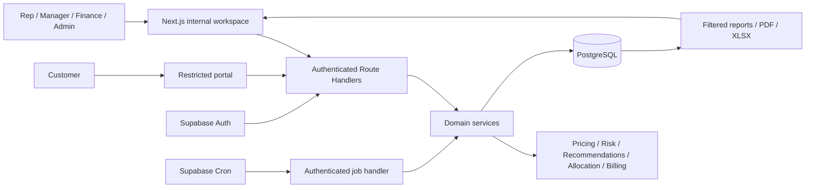

# DealFlow360 — End-to-End Implementation Plan

**Build specification • 5 September 2026 • Four developers • 24 hours**

Companion: **DealFlow360 — Solution Report**. This plan defines proposed implementation decisions; it does not claim that an application has already been built, deployed, or tested.

## 1. Delivery contract

Build the entire required workflow with real calculations and persisted changes. Use modest forms and tables where necessary. There are three delivery classes:

- **R — Required:** explicitly required behavior from the PDF. It remains part of completion even if implementation falls behind.
- **D — Design decision:** our concrete interpretation where the brief is underspecified; configurable defaults are listed below.
- **I — Innovation:** extra functionality; implement after R passes.

Target scale for the hackathon: one company, INR, up to eight warehouses, 30 catalog variants, 100 customers, and 500 historical orders. These are design/test bounds, not measured capacity limits or hidden hardcoded answers. Hardware has integer quantities; seats have integer quantities; service quantity can be decimal. Mixed quotations may include monthly, quarterly, and yearly recurring lines.

At hour 20, remove I from active work if any R acceptance test fails. If R remains incomplete at submission, name the missing behavior honestly; a fallback is not equivalent to full compliance.

## 2. Stack, setup, and repository

### 2.1 Selected stack

| Concern | Selection | Implementation constraint |
|---|---|---|
| App/API | Next.js 16 App Router, TypeScript, compatible React | Route Handlers use Node runtime; one deployable |
| Runtime/package manager | Node.js 24 LTS target, npm | Confirm hosting support, pin runtime and package lock |
| Design | Tailwind CSS, shadcn/ui, Lucide | One shared shell and component vocabulary |
| Forms/contracts | React Hook Form, Zod | Export request/response schemas and inferred TS types |
| Server data in UI | TanStack Query | Invalidate after mutations; poll active deal/alerts every 5 s |
| Auth | Supabase Auth + `@supabase/ssr` | Email/password for internal and portal users |
| DB | Supabase PostgreSQL + `pg` | Parameterized SQL, checked-out connection per transaction |
| Arithmetic | decimal.js | Persist integer minor units; never binary-float currency math |
| Reports | Recharts, pdf-lib, ExcelJS | PDF and genuine XLSX, generated from filtered queries |
| Tests | Vitest, Playwright | Pure rules, transactional integration, two browser journeys |
| Jobs | Supabase Cron invokes authenticated job route | Durable job runs; no browser-dependent billing |
| Deployment | Vercel + Supabase | Deploy a DB-backed skeleton early |

No separate Express server, Python service, vector database, Redis, message broker, or custom ML pipeline is needed for this scope. If the team already has a tested equivalent stack, retain these domain contracts and replace infrastructure consistently before coding starts.

Current framework/auth guidance: [Next.js setup](https://nextjs.org/docs/app/getting-started/installation), [Node.js release status](https://nodejs.org/en/about/previous-releases), [Vercel Node runtimes](https://vercel.com/docs/functions/runtimes/node-js/node-js-versions), [Supabase SSR](https://supabase.com/docs/guides/auth/server-side/nextjs), [Tailwind framework guides](https://tailwindcss.com/docs/installation/framework-guides), [shadcn installation](https://ui.shadcn.com/docs/installation).

### 2.2 Setup sequence — commands to run when implementation starts

These commands are a proposed bootstrap; they have not been executed for this planning task. Run from the repository parent. Use an agreed patched release; the major below avoids silently adopting a new major.

```powershell
npx create-next-app@16 dealflow360 --ts --tailwind --eslint --app --src-dir --use-npm
cd dealflow360
npm install @supabase/supabase-js @supabase/ssr pg decimal.js zod @tanstack/react-query react-hook-form @hookform/resolvers lucide-react recharts pdf-lib exceljs
npm install -D @types/pg vitest @playwright/test tsx
npx shadcn@latest init
npx shadcn@latest add button input label card table dialog tabs badge select textarea dropdown-menu sheet sonner
npx playwright install chromium
```

Commit the generated lockfile and verify that chosen package versions resolve together. shadcn CLI is a setup-time generator; document its resolved version. Add scripts for `typecheck` (`tsc --noEmit`), `lint` (`eslint .`), `test`, `test:integration`, `test:e2e`, `db:migrate`, `db:seed`, and `jobs:run`. In Next.js 16, run lint explicitly instead of assuming the production build runs it.

Create two Supabase projects if available: development/test and demo. Apply numbered SQL migrations using a small `tsx` migration runner over `DIRECT_DATABASE_URL`. Each migration is recorded with a checksum and applied once inside a transaction where supported. Use a session/direct connection for migration operations and the documented transaction pooler for serverless runtime traffic. [Supabase connection modes](https://supabase.com/docs/guides/database/connecting-to-postgres)

```text
src/
  app/
    (auth)/login/                 # actual routes /login and /signup
    (auth)/signup/
    (internal)/workspace/         # quotes, pipeline, approvals, orders, reports
    (internal)/admin/             # working configuration forms
    portal/                      # separate customer layout
    api/v1/                      # request validation/auth + service calls
  components/ui/                 # shared primitives
  features/
    catalog/ quotes/ approvals/ recommendations/
    fulfillment/ billing/ portal/ reporting/ deal-lab/
  server/
    db/ auth/ services/ repositories/ jobs/
  domain/
    money.ts pricing.ts risk.ts recommendations.ts
    allocation.ts proration.ts health.ts clock.ts
  contracts/                     # Zod DTOs, enums, shared service types
  lib/supabase/                  # client, server, proxy helpers
  proxy.ts                       # SSR session refresh; not sole authorization gate
db/migrations/
scripts/migrate.ts seed.ts run-jobs.ts
tests/unit/ integration/ e2e/
docs/assumptions.md architecture.pdf demo-script.md
```

Pure domain functions accept complete inputs and return results/reasons without database or network access. Services perform authorization, obtain snapshots, call domain functions, and persist inside transactions. Route handlers remain thin.

## 3. Requirement coverage matrix

Owner letters refer to the work allocation in section 12. An acceptance item must be visibly demonstrated or verified by the linked test category; a rendered screen alone is insufficient.

| Brief requirement | Implementation | Owner | Acceptance evidence |
|---|---|---|---|
| A1 login/signup/portal identity | Supabase Auth, role profile, protected routes | A | Signup defaults to Rep; customer cannot access internal APIs |
| A2 product/variant/pricelist | Product and variant forms; price by tier/currency | A | Changing tier/variant changes evaluated price |
| A3 discount/approval configuration | Versioned policy form and risk engine | A | Mixed-category quote routes to highest required step |
| A4 warehouse/replenishment setup | Stock rows, movements, reorder threshold/target, expected receipt | B | Stock receipt changes availability and backorder prompt |
| A5 recurring setup | Monthly/quarterly/yearly plans; change/cancel policies | C | Config changes alter future schedule/proration behavior |
| A6 optional recommendation setup | Basic promotion/margin settings; pairing UI optional | D | Required recommendations work without pairing UI |
| A7 reports/exports/filters | Real queries with period/rep/team/status/product/category | D | PDF and spreadsheet values match filtered records |
| B1 workspace navigation | Quotes, pipeline, reload, backend link, close workspace | A | Each action navigates or refreshes correctly |
| B2 list/pipeline | Quote cards plus status-derived columns | A | Mutations change list and pipeline state |
| B3 builder | Catalog/cart, quantities, line/order discounts, margin | A | Server recomputes; client cannot override prices |
| B4 approval screen | Sequential decisions and reasons, immutable audit events | A | Finance cannot precede Manager; revise invalidates approvals |
| B5 recommendation panel | Co-purchase scoring, promotions, add/dismiss, margin delta | D | Accepting suggestion creates an actual line and new totals |
| B6 split/override/backorder | Allocation engine, reservations, receipt/replan, dispatch | B | Split two warehouses; reject oversell; consolidate remaining stock |
| B7 subscription/billing | One-time invoice, per-cadence recurring schedule, adjustments | C | Quantity and plan changes, cancellation, credit all calculate |
| B8 customer negotiation | Restricted DTO, comments, counteroffer, acceptance | D | Counter routes automatically; old acceptance cannot confirm new terms |
| B9 health/anomaly/nudge | Threshold alerts, fresh queries, durable notifications | D | Alert links to quote; nudge/escalation creates real task |
| Quick test payment | Recorded receipt, allocations, derived invoice status | C | Partial/full payments update outstanding and status |
| Deliverables | Seed, two 5-minute demo flows, one-page diagram, roadmap | All | Fresh setup instructions and reproducible test evidence |

## 4. Architecture and quality priorities



Quality priority order: correctness of commercial/financial state; role/ownership isolation; complete observable journeys; predictable UI; performance on the agreed dataset. Prefer immediate database commits and explicit refresh over additional infrastructure.

Draft quote evaluation can be immediate and debounced. Financial/stock decisions must use authoritative server snapshots. Keep commercial records private/no-store in HTTP and framework caches. Client query caches must be partitioned by user and cleared on sign-out.

**Transactional boundaries:** submit/version quote; act on approval; adopt/accept candidate; finalize order; reserve/reallocate/dispatch inventory; generate a charge; allocate a payment or credit. Each boundary writes its audit event in the same transaction. Notifications are recorded transactionally and can be delivered/read later.

For `pg`, use a single checked-out client from BEGIN through COMMIT/ROLLBACK and release it in `finally`; `pool.query` calls cannot stand in for a single multi-query transaction. [node-postgres transactions](https://node-postgres.com/features/transactions)

## 5. Data model and invariants

Use UUID IDs, `created_at`/`updated_at`, UTC timestamps, and explicit currency codes. Store commercial calendar dates as dates. Invoice references use a database sequence; UUID is the technical key. Foreign keys should normally RESTRICT deletion of commercial history; configuration is archived.

| Table/group | Essential fields and relationships |
|---|---|
| `profiles` | `auth_user_id`, role, team_id, customer_id nullable, is_active; role/customer mapping is server-controlled |
| `teams`, `customers` | Name; customer tier, contact details, currency, owner rep; customer has many portal profiles |
| `categories`, `products` | Category; name, description, unit, base price/cost/currency/tax, fulfillment_kind STOCK/NONE, charge_kind ONE_TIME/RECURRING |
| `product_variants` | product_id, SKU, attributes JSON, price_extra_minor, cost_minor, substitution_group optional |
| `price_rules` | variant_id, tier, currency, unit_price_minor, priority, active dates; deterministic precedence |
| `discount_policies` | Immutable version JSON: tier/category ceilings, threshold ranges, floor margins, aggregate limits, effective_at |
| `warehouses`, `stock_levels` | Shipping fixed cost/weight; unique warehouse+variant, on_hand, reserved, reorder_point, target_qty, expected_receipt_date |
| `stock_movements` | variant, warehouse, signed quantity, RECEIPT/DISPATCH/ADJUSTMENT, reference, idempotency key |
| `subscription_plans` | interval_months in 1/3/12, interval_price_minor and interval_cost_minor, tax rate, proration/cancel policy, anchor convention |
| `quotes` | customer, rep/team, current_revision_id, stage, row_version, valid_until, last_business_activity_at |
| `quote_revisions` | quote_id, revision_no unique, source, currency, price/policy snapshots, risk result, commercial_hash, seller_adopted_at, customer_accepted_at |
| `quote_lines` | revision_id, stable_line_key, variant/plan, qty, resolved price/cost/tax snapshots, line/order discount, totals |
| `approval_requests` | revision_id, step 1/2, approver_role, status, actor, decision reason/time; unique revision+step |
| `negotiation_requests` | quote/revision, customer actor, line key optional, type COMMENT/CHANGE/COUNTER, payload, response/status |
| `orders`, `order_lines` | Unique originating quote; accepted revision, immutable line snapshots, order/fulfillment/billing statuses |
| `shipments`, `shipment_lines` | order, warehouse, status DRAFT/RESERVED/DISPATCHED; quantities linked to order lines |
| `reservations` | order_line, stock row, quantity, status; exactly tracks unshipped held stock |
| `backorders` | order_line, remaining quantity, expected date, status; no invented receipt date |
| `subscriptions` | order_line, customer, plan/discounted-price/cost/tax snapshots, quantity, anchor_day, period_start/end, status, next_bill_at |
| `subscription_changes` | subscription, effective_date, prior/new snapshots, type, adjustment references, unique request key |
| `invoices`, `invoice_lines` | customer/order, currency, status, due date; line amount/tax and coverage_start/end, source charge key unique |
| `payments`, `payment_allocations` | Amount, method/reference, recorded_at; allocation to invoice; allocations cannot exceed payment or outstanding |
| `credit_notes`, `credit_allocations`, `refunds` | Original invoice/coverage, reason, amount, applied balance, refund reference; no duplicate credit for same unused coverage |
| `recommendation_dismissals` | actor, quote revision, variant; dismissed recommendations remain dismissed for that revision |
| `alerts`, `notifications` | quote/order/subscription, type, reasons, OPEN/RESOLVED, dedupe key; nudge/escalation status |
| `audit_events` | actor, action, entity, revision, before/after summary, reason, timestamp, request ID; append-only to runtime role |
| `job_runs`, `idempotency_requests` | job/date cursor and lease; actor+operation+key, payload hash, saved result |

Promotion flag and minimum recommendation margin can live on products/settings. Purchase history for recommendation queries is derived from finalized order lines, not a second invented history source. Store relevant versioned configuration as JSON where that saves UI/schema time, but validate it with Zod before saving.

### 5.1 Database checks and indices

- Amounts persisted in minor units as BIGINT; quantity as NUMERIC where needed. Serialize BIGINT/NUMERIC as decimal strings in JSON to avoid precision loss.
- `on_hand >= 0`, `reserved >= 0`, `reserved <= on_hand`; quantity and valid recurring price are positive; discounts are 0–10,000 basis points.
- Unique order per quote; unique revision number; unique billing charge key; unique movement request key; unique actor+operation+idempotency key.
- Foreign keys for all commercial associations. Enforce customer consistency through service checks and compound foreign keys where practical.
- `period_end > period_start`; confirmed/issued amounts remain immutable. Correct them through a revision, adjustment, or credit rather than overwriting history.
- Index quotes by owner/stage/activity, approvals by role/status, stock by variant+warehouse, subscriptions by next_bill_at/status, invoices by customer/status/due_date, and alerts by status/type.
- Add optimistic `row_version` checks to mutable quote/configuration records. Return 409 if another user has edited the record.
- Validate balanced allocation quantities inside the locked transaction. A UI-disabled button is not a concurrency control.

### 5.2 Currency and commercial amounts

`INR 10,000.00` is stored as `1000000` minor units. Use decimal arithmetic for intermediate percentages and proration, then round half-up to the currency's minor unit. Keep tax and net components separate. All seed examples below use zero tax for readable arithmetic; separate tests exercise a configured nonzero tax.

One-time amounts, recurring interval prices, MRR, and lifetime value are different metrics. Display one-time subtotal, each recurring subtotal/cadence, and initial invoice amount separately. For mixed quote risk, use each recurring line's **full first billing interval value**, excluding initial proration. Label the resulting margin “quote contribution on one-time plus first full recurring periods”; display recurring margin per cadence alongside it. This prevents a tiny prorated first charge from hiding a risky annual/recurring discount.

## 6. State machines and quotation versioning

### 6.1 Quote state

Use a visible sales stage plus independent approval and acceptance facts. Stage alone cannot authorize execution.

```text
DRAFT -> REVIEW -> SENT -> UNDER_NEGOTIATION -> CONFIRMED
                    |                              |
                    +-> LOST / EXPIRED              +-> unique ORDER
```

Approval for a revision: `NOT_REQUIRED`, `PENDING_MANAGER`, `PENDING_FINANCE`, `APPROVED`, `REJECTED`, or `REVISION_REQUIRED`. Customer acceptance and seller adoption each record the exact revision/hash.

**Execution gate:** current revision is seller-adopted, customer-accepted, valid/unexpired, and approval is APPROVED or NOT_REQUIRED. An order is created only when all gates hold. Both the final approver and customer-acceptance handlers call the same `tryFinalizeOrder` service; the uniqueness constraint makes retries safe.

Submitted/sent commercial snapshots are immutable. Changing product, quantity, price, discount, tax, cadence, delivery promise, or payment terms creates a revision and clears its acceptance/approval state. Existing decisions remain attached to the old revision for history. Policy updates do not silently rewrite an already submitted quote; explicit re-evaluation creates a new revision. Finalization checks expiry and current inventory.

Once an order exists, reject quotation commercial revisions; later supported subscription changes use their own billing workflow. Never mutate the accepted quotation to implement a subscription adjustment.

### 6.2 Customer counteroffer

1. Verify customer ownership and expected current revision.
2. Store a COUNTER/CHANGE request and a candidate revision containing the proposed terms. It becomes the active negotiation candidate; the previous version remains historical.
3. Recompute risk immediately and create the correct approval requests. UI shows “Under negotiation / awaiting approval” where needed.
4. Seller adoption is separate: the rep accepts the proposed commercial version or responds with another revision. Even a counteroffer within thresholds requires seller adoption.
5. Customer confirms that exact candidate. If approvals or seller adoption remain, record conditional acceptance and show the remaining gates.
6. Once all gates clear, create the order once. Comments that do not change terms do not invalidate approvals.

Manager can review a counter candidate, but approval alone does not imply seller adoption or customer acceptance. Finance cannot act before Manager. Rejecting/returning a candidate blocks its execution until a new valid revision is submitted.

### 6.3 Order and billing states

Order fulfillment: `UNALLOCATED -> PARTIALLY_RESERVED / RESERVED -> PARTIALLY_DISPATCHED / DISPATCHED`. Backorder is recorded per line, not inferred only from a label. Cancellation before any dispatch/invoice can release reservations; post-dispatch order amendments/returns are a roadmap item. Subscription cancellation remains required and supported independently.

Invoice: `DRAFT -> ISSUED -> PARTIALLY_PAID -> PAID`, with credited/outstanding amounts displayed separately. Credit notes adjust balances; they do not delete invoices. Subscription: `PENDING_ACTIVATION -> ACTIVE -> CANCEL_AT_PERIOD_END / CANCELED`. Domain services enforce transitions on the server.

## 7. Business engines — explicit rules

### 7.1 Pricing and margin

Resolve price by exact variant+tier+currency rule, then variant default plus configured extra price, then product default. Reject ambiguous equal-priority rules and missing currency prices. Freeze the resolved price, cost, and tax in each submitted revision. A recurring line resolves its interval price/cost from the selected plan/rule, not the hardware price field.

For quantity `q`, unit price `p`, line discount fraction `l`, and order discount fraction `o`:

```text
base = q * p
after_line = base * (1 - l)
after_all = after_line * (1 - o)
effective_discount = 1 - (1 - l) * (1 - o)
line_margin_amount = net_before_tax - q * unit_cost_for_same_period
margin_percent = 100 * margin_amount / net_before_tax
```

Thus 10% line discount followed by 10% order discount is 19%, not 20%. Apply order discount proportionally to eligible lines and distribute the final rounding residual deterministically by fractional remainder then stable line key. Compute tax on discounted net and sum rounded line tax. Display margin as undefined when net is zero; such quotes cannot silently pass a configured margin floor.

Label the default margin as contribution before shipping and tax. Show shipment cost separately; an optional after-shipping contribution must subtract it exactly once and remain separately labeled.

Client sends identifiers, quantities, requested discounts and expected revision; the server resolves authoritative prices. Preview results can be recomputed with the same pure function in the browser, but only server results may be persisted.

### 7.2 Blended discount risk

The PDF supplies examples, not a formula. The following is a proposed configurable rule designed to survive line splitting:

```text
allowed_i = min(customer_tier_ceiling, category_ceiling_i)
excess_pp_i = max(0, effective_discount_percent_i - allowed_i)
excess_value_i = base_i * excess_pp_i / 100
W = sum(excess_value_i) / sum(base_i) * 100
M = max(excess_pp_i)
E = sum(excess_value_i)
D = total_discount_value / total_base_value * 100
```

Evaluate worst-line risk `M`, value-weighted excess `W`, excess concession amount `E`, overall effective discount `D`, and margin. Show all components; `W` is the displayed blended excess score in percentage points, not a probability.

Illustrative seed policy:

- Bronze/Silver/Gold ceilings: 5/10/15%; Hardware 15%, Services 10%, Subscriptions 10%.
- Manager required for any positive excess, or `D > 12%` aggregate ceiling, or aggregate quote margin below 20%.
- Manager then Finance required if `M >= 8 pp`, `W >= 3 pp`, `E >= INR 5,000`, aggregate margin below 15%, or any line has negative contribution.
- No approval only when every applicable check permits it. Reject impossible inputs before routing.

These thresholds are editable illustrative policy. Define exact inclusive boundaries in the UI and tests. Evaluate both line/order discounts together. Splitting a line into identical smaller lines must not reduce `M`, `W`, `E`, or required approval. Do not sum raw percentage excesses across rows, which is sensitive to row splitting.

The separate aggregate ceiling matters: individually permissible discounts can still exceed a company's overall concession budget. If a quote has no commercial value, reject it rather than divide by zero.

Return structured `reasons[]` with code, line reference, observed value, threshold, and required level. Required approval is the maximum across reasons; Finance always follows Manager. Return-for-revision closes the current approval attempt; old decisions cannot be reused after edits.

### 7.3 Recommendations without ML training

Build co-purchase counts from historical finalized orders, treating a product as present once per order. Exclude the current quote and canceled orders. For cart product `a` and candidate `b`:

```text
confidence(a -> b) = order_count(a and b) / order_count(a)
history_score(b) = max confidence(a -> b) across cart products a
score(b) = 0.75 * history_score(b) + 0.15 * promoted(b)
           + 0.10 * normalized_positive_contribution(b)
```

Use these weights as configurable defaults. Filter out cart items, inactive products, incompatible currency/plan options, previously dismissed items, and items below minimum candidate margin. Stocked candidates with no stock can be suppressed or clearly marked backordered; never imply immediate availability.

Reprice the candidate for the current customer. Show a promotion badge and a reason such as “Appeared with laptops in 8 of 12 eligible historical orders.” Add one default unit for the preview and evaluate the entire quote again. Show both contribution amount delta and margin percentage-point delta. A profitable add-on can still reduce the quote's margin percentage.

For upsell replacement, use explicit `substitution_group`/upgrade mapping and compatible attributes; generic co-purchase should only add a complementary item. With fewer than five relevant historical orders, label limited history and use eligible promoted/category fallback or no result. Adding/dismissing is a persisted action; never hardcode a recommendation to a specific demo customer.

### 7.4 Warehouse splitting and stock correctness

Services/non-stock recurring seats bypass allocation. For each stocked variant, available stock is `on_hand - reserved`. Before confirmation the split is only a live preview.

For at most eight warehouses, enumerate nonempty subsets (at most 255). Compute the maximum fulfillable quantity per SKU using all eligible warehouses. Consider subsets that can meet that same per-SKU fulfillment target, then allocate within each subset, compute actual used warehouses, and minimize:

```text
shipment_weight * number_of_used_warehouses
  + cost_weight * sum(configured_shipping_cost_per_used_warehouse)
```

Tie-break by stable warehouse ID. First maximize fulfillment per SKU; never choose a cheap subset that unnecessarily creates backorders. No cross-SKU warehouse capacity or carrier routing is assumed. Costs are configured estimates, not live courier quotes. Beyond eight warehouses, a greedy fallback can be added later and labeled heuristic.

On accepting a split/finalizing the order, lock the order and relevant stock rows in consistent variant+warehouse order. Re-read stock, validate allocations, reserve only available units, create shipments/backorders, and commit together. If preview stock changed, return a refreshed feasible allocation or a 409 requiring review; never silently oversell. PostgreSQL row locks protect conflicting writers until transaction end. [PostgreSQL locking](https://www.postgresql.org/docs/current/explicit-locking.html)

Manual override uses the same validator: per-line allocation plus backorder equals requested unshipped quantity, stock limits hold, and only authorized Operations/Admin can save. A stock receipt updates inventory and creates/recomputes a consolidation suggestion for affected open backorders. UI polling makes it appear automatically.

When replanning an existing order, its own unshipped reservations are reusable: `available_to_order = on_hand - all_reserved + own_unshipped_reserved`. Apply reservation differences atomically. Never reallocate quantities already dispatched. Dispatch subtracts the same quantity from both on_hand and reserved and writes a movement once. Receiving a duplicate receipt key must not increase stock twice.

Replenishment rules identify when availability drops below a reorder point and propose `max(0, target_qty - available)`; Operations records receipt and expected date. This is functional threshold-based replenishment, not a new supplier procurement integration.

### 7.5 Recurring billing, proration, credits, and payment

Use server-side calendar arithmetic, one company billing timezone (`Asia/Kolkata`), and periods `[start, end)`. Monthly/quarterly/yearly mean 1/3/12 calendar months, not fixed 30/90/365 days. Preserve original anchor day across short months: a Jan 31 anchor can return to Mar 31 after February's clamp.

When the accepted order is finalized, generate one one-time invoice for one-time lines. Create one subscription per recurring order line and its first scheduled charge. Group compatible recurring lines by customer/order, currency, cadence, and coverage period; show recurring invoices separately from one-time invoices under the same order. Activation starts on the configured date, defaulting to confirmation date.

Support billing anchors `ACTIVATION_DATE` and `CALENDAR_MONTH_START`. For a mid-month start on a calendar-month plan, the first invoice covers only the remaining interval and later charges cover full intervals. Quarterly/yearly plans use the configured anchor period consistently. Store the actual coverage interval on every charge.

**Quantity change within the same interval, effective immediately:**

```text
remaining_fraction = calendar_days(effective_date, period_end)
                   / calendar_days(period_start, period_end)
adjustment_net = (new_quantity - old_quantity)
               * discounted_unit_interval_price * remaining_fraction
```

Positive adjustment creates an additional charge; negative adjustment creates a credit for unused paid/owed service according to configured policy. Default is prorate immediately; `NEXT_PERIOD` stores a scheduled change without current-cycle adjustment. Effective date must be within the open period. Block backdated edits that would require reopening an issued historical period.

**Worked example:** Sep 1–Oct 1 is 30 days. Ten seats at INR 300/month become fifteen seats on Sep 16. Fifteen days remain. Additional amount before tax = `5 * 300 * 15/30 = INR 750`. A second identical request with the same key produces no second charge.

**Plan change:** for same-cadence price changes, credit unused old coverage and charge the new price for the remaining fraction. For interval changes (monthly to yearly), close the old period with its unused-service credit and open a full new interval anchored at the change date. Preserve both charge/credit records; do not approximate a year as twelve identical month fractions. The UI previews both amounts before saving.

**Cancellation:** `END_OF_PERIOD` stops renewal with no unused-time credit. `IMMEDIATE_PRORATED` stops service and credits eligible unused coverage. Calculate against the effective charge segments, including earlier changes and credits, to prevent crediting the same period twice. A Sep 21 cancellation after the example upgrade yields INR 1,500 unused service before tax (15 seats * 300 * 10/30), assuming all preceding charges remain eligible.

Credits first reduce outstanding invoice debt. Any residual becomes customer credit or a Finance-recorded refund; never claim that money was returned without a refund record. Refund amount cannot exceed net paid, unrefunded eligible balance. An unpaid subscription cancellation can remove debt but cannot refund money never received. Tax adjustments mirror the original line tax configuration and rounding.

**Recurring execution:** compute due subscriptions with `next_bill_at <= business_today`. Lock one subscription while checking/inserting charge key `(subscription_id, coverage_start, coverage_end, charge_type, change_id_or_base)`. Record charge, invoice, audit, and next period in one transaction. Unique keys protect against repeated or overlapping jobs. Process a bounded batch and leave the rest due for the next run; catch-up produces each missed interval once.

Payment recording creates a payment and allocations atomically. Lock invoices in stable order; allocated total cannot exceed payment or current invoice outstanding. Derive `outstanding = issued_total - applied_credits - allocated_payments`; PAID only when outstanding is zero. Extra receipts remain unallocated/customer credit instead of making an invoice negative. No live payment gateway is required for this plan.

### 7.6 Health, anomaly, and reporting

Stalled = no meaningful rep/customer activity for configurable days (seed 3), excluding terminal deals. Page views, polling, and automatic alerts do not reset activity. An actual comment, revision, or decision does.

Discount anomaly uses the rep's previous finalized quotes, excluding the current quote. Compute one effective discount per historical quote. With at least five observations, flag when current discount exceeds historical mean by at least five percentage points **and** is more than two standard deviations above it; use a two-percentage-point floor on standard deviation. With fewer observations, report insufficient personal history and use only policy alerts. These are risk indicators, not fraud accusations or predicted probabilities.

Delivery slippage = unshipped quantity past promised date, or known replenishment/estimated dispatch later than the promise. If replenishment date is unknown, label “delivery date unconfirmed,” not a fabricated estimate. Store promise dates on the accepted order lines.

Optional displayed health index: 100 minus explicitly listed penalties for open approval delay, stock uncertainty, and stalled activity. Call it a rule-based health index, never win probability. Required alerts work without this index.

Every alert has a dedupe key and source record. Resolve it when its underlying condition clears. A nudge creates an assigned in-app notification; escalation assigns a manager notification. Rate-limit repeated nudges and audit their creation. Email is optional and requires a configured transport; this planning task sends no messages.

Reports expose the required filters and their date semantics: quote reports by creation date, orders by confirmation date, invoices by issue date, payments by recorded date. Report approval status from the current revision only. Export the same filtered dataset, include generation time/currency, and keep historical revision totals out of current pipeline sums. Report one-time sales, recurring MRR, invoiced revenue, and cash collected separately. Normalizing yearly recurring price / 12 is an MRR metric, not an invoice amount.

PDF generation uses pdf-lib. ExcelJS produces XLSX; verify whether the brief's “XLS” means any Excel workbook or the legacy binary format. If literal XLS is required, add a writer that supports that format; changing a file extension is not a conversion. [pdf-lib](https://github.com/Hopding/pdf-lib) / [ExcelJS](https://github.com/exceljs/exceljs)

## 8. Service and API contracts

Define the shared contracts in hour 1, before four people implement their modules. These examples define the shape, not copy-paste complete application code.

```typescript
type MoneyMinor = string; // JSON decimal integer, parsed with Decimal/BigInt
type ApprovalLevel = 'NONE' | 'MANAGER' | 'MANAGER_FINANCE';
type Actor = { userId: string; role: Role; customerId?: string };
type TxContext = { db: PoolClient; actor: Actor; now: Date; requestId: string };

interface QuoteEvaluation {
  revisionId: string;
  policyVersion: number;
  oneTimeNetMinor: MoneyMinor;
  recurring: Array<{ intervalMonths: 1 | 3 | 12; netMinor: MoneyMinor }>;
  initialDueMinor: MoneyMinor;
  risk: {
    level: ApprovalLevel;
    blendedExcessPp: string;
    worstLineExcessPp: string;
    excessValueMinor: MoneyMinor;
    reasons: RiskReason[];
  };
  inventorySnapshotVersion: string;
}

// Pure rules
evaluatePricing(input: PricingInput): PricingResult;
evaluateRisk(input: RiskInput): RiskResult;
rankRecommendations(input: RecommendationInput): Recommendation[];
allocateStock(input: AllocationInput): AllocationResult;
calculateProration(input: ProrationInput): ProrationResult;

// Transaction-aware services; callers share ctx.db during finalization
submitQuote(ctx: TxContext, input: SubmitQuoteInput): QuoteEvaluation;
createCounterRevision(ctx: TxContext, input: CounterInput): QuoteEvaluation;
recordApproval(ctx: TxContext, input: ApprovalInput): ApprovalResult;
tryFinalizeOrder(ctx: TxContext, revisionId: string): FinalizationResult;
reserveOrder(ctx: TxContext, orderId: string): AllocationResult;
initializeBilling(ctx: TxContext, orderId: string): BillingResult;
applySubscriptionChange(ctx: TxContext, input: ChangeInput): ChangeResult;
recordPayment(ctx: TxContext, input: PaymentInput): InvoiceBalance[];
```

`tryFinalizeOrder` returns `WAITING` with missing gates or `FINALIZED` with order ID. It locks quote/current revision, checks the commercial hash and conditions, creates the order, calls B's reservation and C's billing initialization using the same DB client, and records the audit event. Shortage creates an explicit backorder; it is not silently discarded or treated as full fulfillment. Any database failure rolls back the transaction.

### 8.1 REST resources

Use `/api/v1` and consistent resource names. All list endpoints support `page`, `pageSize` (max 100), documented sort fields, and required role-scoped filters.

| Resource/endpoints | Behavior |
|---|---|
| `GET /me` | Current verified profile and allowed UI capabilities |
| `GET/POST /customers`, `/products`, `/variants`, `/price-rules` | Scoped catalog/master data; PATCH archives/updates permitted records |
| `GET/POST /discount-policies`, `/warehouses`, `/subscription-plans` | Functional versioned configuration |
| `POST /stock-movements` | Authorized receipt/adjustment with reference and idempotency key |
| `GET/POST /quotes`; `GET /quotes/:id` | Scoped list/create/detail |
| `POST /quotes/:id/evaluations` | Read-only draft evaluation; recompute prices, risk, margin, preview |
| `POST /quotes/:id/revisions` | Save commercial edits/candidate revision with expected row version |
| `POST /quotes/:id/submissions` | Submit exact revision; automatically create approval requests |
| `POST /quotes/:id/shares` | Mark SENT and return restricted portal URL; does not send email |
| `GET /quotes/:id/recommendations` | Ranked eligible recommendations, current revision |
| `POST /quotes/:id/recommendation-dismissals` | Persist dismissal; adding uses revision creation |
| `GET /approval-requests`; `POST /approval-requests/:id/decisions` | Approve/reject/return, actor from server session |
| `GET /portal/quotes`; `GET /portal/quotes/:id` | Customer-only responses, no internal fields |
| `POST /portal/quotes/:id/requests` | Comment, line change, or counteroffer; re-evaluate commercial changes |
| `POST /portal/quotes/:id/acceptances` | Accept exact revision/hash; may remain conditional |
| `POST /quotes/:id/adoptions` | Rep adopts customer's proposed candidate |
| `GET /orders/:id`; `GET /orders/:id/allocation` | Accepted commercial data and current inventory proposal |
| `POST /orders/:id/allocations`; `POST /shipments/:id/dispatches` | Accept/override/replan; dispatch real reserved quantity |
| `GET /subscriptions/:id`; `POST /subscriptions/:id/changes` | Preview/commit quantity or plan change with idempotency |
| `POST /subscriptions/:id/cancellations` | Apply configured immediate/end-period policy |
| `GET /invoices/:id`; `POST /payments`; `POST /refunds` | Financial records and allocations under Finance/Operations role |
| `GET /alerts`; `POST /alerts/:id/nudges` | Live issues and durable nudge/escalation |
| `GET /reports/sales`; `GET /reports/sales/export?format=pdf|xlsx` | Same filtered source data, role restrictions preserved |
| `POST /internal/job-runs` | Cron-authorized bounded billing/alert processing |
| `POST /quotes/:id/scenarios` | Optional Deal Lab; no persistence into the live quote until explicit apply |

Mutation requests include `expectedVersion` where stale edits are possible. Order finalization, stock receipts, payments, adjustments, and approval actions accept `Idempotency-Key`. Bind the key to actor, operation, entity, and canonical request-body hash; a replay of the same request returns the saved result, while reusing a key with another body returns 409. The key claim and domain mutation must share a transaction to close retry races.

### 8.2 Response and error semantics

```json
{
  "data": { "id": "...", "rowVersion": 4 },
  "meta": { "requestId": "...", "evaluatedAt": "..." }
}
```

```json
{
  "error": {
    "code": "STALE_QUOTE_VERSION",
    "message": "This quotation changed. Refresh before accepting it.",
    "details": { "currentVersion": 4 }
  },
  "requestId": "..."
}
```

Use 400 malformed input, 401 unauthenticated, 403 forbidden capability, 404 missing or foreign customer resource, 409 stale/conflicting state, 422 business-rule validation, and 500 generic unexpected failure. Never expose SQL errors, stack traces, secrets, or internal price/cost fields in portal errors. Validate inputs with Zod and whitelist writable fields; clients cannot set roles, actor IDs, approvals, invoice paid status, or stored totals.

## 9. UI routes and interaction specification

| Screen | Required interactions and states |
|---|---|
| Login/signup | Error handling, signed-in redirect, server-assigned Rep role; customer uses assigned credentials |
| Workspace/quotes | Filter, create, customer/amount/stage cards, empty state, reload timestamp |
| Pipeline | Columns derived from commercial status; move through valid actions, not unrestricted drag |
| Quote builder | Search/category, variant choice, +/- quantity, discounts, price breakdown, save/submit, pending evaluation state |
| Context panel | Risk reasons/chain, live margin, recommended items with Add/Dismiss, stock preview |
| Approvals | Exact revision and changed terms, sequential steps, reason input, approve/reject/return |
| Fulfillment | Warehouse quantities, shipment estimate/cost, shortage, accept/override, backorder receipt prompt |
| Billing | One-time and recurring groups, invoice/payment status, future periods, change/cancel preview, credit/refund history |
| Portal | Separate layout, own quotes, line discussion, counter, exact-version acceptance, pending approval banner |
| Deal health | Stalled/anomaly/slippage tabs, direct quote link, nudge/escalate action and success state |
| Reports | Required filters, charts/table, export; clear one-time/recurring/invoiced/collected labels |
| Admin | Reusable list/form pattern for products, variants, prices, policies, warehouses, plans/settings |

Every data screen needs loading, empty, error, and stale-version states. Disable double submission while pending, but rely on server idempotency for correctness. Use optimistic UI only for reversible cosmetic actions; money/approval/stock mutations display confirmed server results. Do not expose implementation terms such as database transaction or JWT in the user flow.

“Go to Back-end” opens configuration permitted by the role; Rep may see read-only catalog context but cannot edit policy. “Close Workspace” returns to the permitted home screen and clears local draft-only UI state after saving/explicit discard, without falsely claiming that it signs the user out. Provide a separate sign-out control.

## 10. Authorization and data protection

| Role | Allowed scope |
|---|---|
| Sales Rep | Own quotes and related orders; read permitted product prices/availability; propose terms and respond to own customers |
| Sales Manager | Team quotes/approvals, discount-policy/chain setup, team health/reporting |
| Finance/Operations | Finance-step decisions after Manager, fulfillment/replenishment, billing/payment/credit/refund operations |
| Customer | Only quotes/invoices explicitly linked to their customer_id; negotiate and accept customer-facing terms |
| Admin | Configuration and user/role administration, platform reporting; can act in explicit audited business roles |

Public internal signup creates only a Sales Rep profile. Role elevation is admin-only; a portal profile's customer_id is assigned server-side. No self-selected Manager/Finance/Admin option is accepted. In production signup would be restricted by invitation/domain; the demo can expose Rep signup as required.

Verify token identity in every protected handler using the documented SSR flow, then fetch current role and active status from `profiles`. Use an up-to-date auth lookup on high-impact writes if immediate session revocation is required. Proxy redirects improve navigation but do not replace API authorization. Validate same-origin/CSRF protection for cookie-authenticated mutations.

Runtime database access uses a server-only restricted role with no superuser/BYPASSRLS privilege. Place business tables in a schema not exposed by Supabase's browser Data API and revoke anon/authenticated direct business-table privileges. Grant the runtime role only needed operations and make audit history append-only. Since requests use a backend DB role, SQL ownership scoping must be explicit; do not assume the end user's Supabase JWT automatically secures raw `pg` queries. Auth tables remain managed by Supabase.

Portal queries select an explicit safe field list and scope by session-mapped customer_id in the query itself. Separately checking a URL then fetching unrestricted objects is insufficient. Never return costs/margins/policy snapshots to the customer and merely hide them in CSS. A link containing a UUID is not authentication.

If magic links are later added, rely on Supabase's authentication flow and recheck quote ownership after login. Email/password is sufficient for the PDF and avoids a demo dependency on email delivery.

## 11. Jobs, freshness, and infrastructure

### 11.1 Background processing

Use Supabase Cron to call the job endpoint through an authenticated HTTP request on an agreed interval, for example every minute for alerts and hourly for date-based billing. Keep the secret in Supabase Vault/server settings. Cron supports recurring jobs and monitoring; configure actual invocation and verify a successful persisted run. [Supabase Cron](https://supabase.com/docs/guides/cron)

Do not put an in-memory timer in a serverless function. Do not assume Vercel Hobby allows minute-level cron: its current cron schedule is limited to daily execution. Supabase Cron is the selected scheduler; hosting plan limits must be checked during setup. [Vercel cron limits](https://vercel.com/docs/cron-jobs/usage-and-pricing)

The route authenticates a job secret, acquires a database-backed lease with expiry, and processes a bounded batch such as 25 due subscriptions. Use `FOR UPDATE SKIP LOCKED` or equivalent claim-and-lease logic with charge uniqueness. Persist success/failure, processed counts, and sanitized error; release/expire leases. A retry after partial progress skips already-created charge keys. Do not use session-scoped advisory locks with a transaction pooler.

On stock receipt, generate affected backorder prompts synchronously with the receipt operation or a durable event. On quote changes, evaluate immediate policy alerts synchronously. The periodic job catches inactivity/time-driven conditions and resolves stale alerts.

A Finance/Admin “Process due billing” action can call the same service to demonstrate/recover missed jobs. It is an observable operation, not fake invoice creation. The scheduled runner must still be configured for a fully working recurring implementation.

### 11.2 Freshness and demo clock

Query invalidation refreshes the acting user's screen immediately. Five-second polling refreshes other sessions and the dashboard; show last updated time. This is near-real-time behavior. If strict push delivery is required by organizers, add authenticated private realtime notifications that only trigger a fresh authorized fetch; keep the transaction logic unchanged.

Inject a `Clock` into pure functions/services for tests. For the live billing demonstration, a separate demo deployment may expose an Admin-only scenario date, clearly labeled “Demo business date.” Jobs and request evaluation use the same clock. Real deployment uses wall-clock time and rejects client-supplied business dates. The scenario clock changes inputs to real billing logic; it does not insert predetermined results.

### 11.3 Environment inventory

```text
NEXT_PUBLIC_SUPABASE_URL
NEXT_PUBLIC_SUPABASE_PUBLISHABLE_KEY
DATABASE_URL                  # runtime transaction pooler, server only
DIRECT_DATABASE_URL           # migration/seed connection, scripts only
APP_BASE_URL
JOB_SECRET                    # server/Vault only
BILLING_TIMEZONE=Asia/Kolkata
DEMO_MODE=false
```

Use a server-only Supabase admin credential only in a controlled seed script if it creates demo Auth users. It is not a browser env var and need not exist in the deployed request runtime. `.env.example` contains placeholders; actual secrets are excluded from source control. Separate demo and production/test records by database/project, not by a fake customer-side switch.

## 12. Four-person execution plan

Each member owns domain code and its screens. This prevents a single frontend member from becoming the integration bottleneck.

| Member | Primary vertical scope | Handoff contract |
|---|---|---|
| A — integration lead | Bootstrap/Auth, shared schemas, catalog/pricing, quotes/risk/approval, finalization coordinator | QuoteEvaluation, TxContext, tryFinalizeOrder |
| B | Warehouse setup, allocation, reservations, receipts, dispatch, backorder UI | previewAllocation, reserveOrder, replanOrder |
| C | Plans, invoices, recurring jobs, proration, credits, payment/refund UI | initializeBilling, applySubscriptionChange, recordPayment |
| D | Restricted portal, negotiation, recommendations, health/report UI, exports | CounterInput/portal DTO, recommendations, reports |

A's load is the critical path. During hours 0–2, D helps build shared shell/forms and auth screens; B owns schema/migration infrastructure; C owns money/date primitives and seed conventions. After B's reservation flow passes, B helps D with report filters/exports. Do not let A implement every shared utility and all screens alone.

Use one main integration branch and short-lived member branches. One migration owner reviews schema changes; members do not independently renumber shared migrations. Merge small vertical increments about every two hours, and keep the main branch runnable. Run the core tests on each merge. Do not wait until the final hours to connect modules.

### 12.1 Hour-by-hour milestones

| Window | A | B | C | D | Exit criterion |
|---|---|---|---|---|---|
| 0–2 | Bootstrap, roles, contracts | Schema/migration, stock tables | Money/date helpers, billing schema | Shared UI/auth pages, portal DTO | Deployed login + DB query; version/money/status contracts agreed |
| 2–5 | Catalog/builder, pricing/risk | Warehouse setup + split engine | Plan setup, one-time invoice/payment | Portal ownership + recommendations query | Live quote totals/risk; unit rules pass |
| 5–8 | Submission/approval/finalization | Atomic reserve/dispatch | Billing initialization + receipt status | Portal acceptance + ordinary flow UI | Flow A completes quote to paid invoice through UI |
| 8–12 | Revisions, sequential approvals | Backorders, receive/replan/override | Recurrence + proration + credit engine | Counteroffer/adoption, live recommendation cards | Counter automatically re-routes; mixed order persists correctly |
| 12–16 | Integration and policy edge cases | Concurrency checks; help reports | Plan change/cancel, due job, refunds | Health alerts, nudge, filters/charts | Flow B completes approval, negotiation, split and billing |
| 16–20 | Fix authorization/stale-state bugs | Exports + fulfillment edge cases | Retry/rounding/job tests | UI states, reports, portal negative tests | All required acceptance checks pass; exports open |
| 20–22 | Optional approval-ready Deal Lab | Support fixes and data | Support fixes and billing rehearsal | Explanation panel/demo polish | Innovation only if required behavior is green |
| 22–24 | Release, README, final verification | Architecture/demo preparation | Demo data/payment checks | Rehearsal/screens and backup | Frozen build, 5-minute rehearsal, deliverables ready |

Budget 15-minute integration checkpoints inside these windows. Four people working separately for 24 hours is not 96 hours of interchangeable work; the shared model and cross-module dependencies constrain throughput.

### 12.2 If a milestone slips

- If hour 8 fails: all work focuses on the ordinary end-to-end flow; use simple tables and dropdowns; remove pipeline drag-and-drop and cosmetic animation.
- If hour 16 fails: eliminate Deal Lab, LLM, magic links, recommendation rule editor, and elaborate visualizations from the build. These are extras or optional presentation choices.
- Preserve sequential approvals, real allocation, real proration, restricted portal, alerts, exports, and payment status. Use basic working forms for configuration rather than static setup pages.
- If hour 20 still fails: spend remaining time on correctness and explicitly record incomplete R items. Do not call a subset a fully compliant implementation.

## 13. Seed dataset and acceptance tests

### 13.1 Deterministic seed data

Create Admin, Rep A, Manager A, Finance/Ops, Customer Alpha, and Customer Beta accounts. Add a second Rep/team for report filters. Use scripted Auth-user creation with a locally supplied password; do not publish reusable credentials in source code.

Create Bronze/Silver/Gold customers, three categories, two laptop variants, a dock accessory, setup service, and support seats with monthly/quarterly/yearly plans. Seed the stated risk policy, plan policies, promotion flags, and margin threshold. Keep all live demo calculations on INR.

Seed stock: Main has 4 of the laptop variant and 10 docks; East has 1 laptop. Shipping fixed costs: Main INR 100, East INR 150. The first scenario consumes 2 Main laptops and 1 dock, leaving Main 2/East 1 for the second scenario. Historical recommendation orders do not create live current reservations. Seed dated stock history/opening adjustments consistently if historical movements are shown.

Historical data: at least 12 eligible laptop orders, of which 8 contain a dock, plus other catalog orders. Seed five or more finalized quotes for a rep's anomaly baseline. Include an inactive nonterminal quote and an overdue promised shipment. Label all seed records as synthetic/demo; never describe their recommendation statistics as real customer behavior.

### 13.2 Flow A — normal sale, recommendation, fulfillment, payment

1. Rep logs in and opens Alpha, Bronze. Add 2 laptops at INR 10,000 each, no discount.
2. Recommendation query suggests a dock at INR 1,000 using stored history. Add one. One-time net becomes INR 21,000 before tax.
3. Submit. No rule violation under the seeded costs/policy; approval status is NOT_REQUIRED.
4. Share portal URL; Alpha logs in and accepts the exact revision. Order finalizes once.
5. Main reserves 2 laptops and 1 dock. Dispatch. One-time invoice is issued for INR 21,000.
6. Finance records INR 21,000 payment. Invoice becomes PAID and outstanding is zero.

This scenario proves a complete low-friction path. Before the live event, also test INR 5,000 then INR 16,000 allocations to verify PARTIALLY_PAID then PAID.

### 13.3 Flow B — negotiation, approvals, split/backorder, hybrid billing

1. Beta is Gold. Add 4 laptops at INR 10,000 each with 12% discount, setup at INR 5,000 with 18% discount, and 10 support seats at INR 300/month with no discount.
2. One-time net = INR 35,200 + INR 4,100 = INR 39,300. Recurring = INR 3,000/month. Full-first-cycle combined net = INR 42,300, presented separately by cadence.
3. Hardware cost is INR 7,000 each, setup cost INR 3,500, seats cost INR 120 each/month. Combined comparison contribution = INR 9,600, approximately 22.70%.
4. Service exceeds the 10% category ceiling by 8 pp. `E = INR 400`, `W = 400/48,000*100 = 0.8333 pp`, `M = 8 pp`. Finance is required because the worst-line check reaches 8, despite small blended excess. Manager then Finance approve revision 1.
5. Customer proposes 25% discount on setup. Revision 2 routes automatically; revision 1 approvals cannot authorize it. One-time net becomes INR 38,950; recurring remains INR 3,000/month. Rep adopts candidate, Manager/Finance approve, and customer accepts this version (either ordering of the independent gates is valid).
6. Finalization reserves Main 2/East 1 laptops and records a backorder of 1. Show two warehouse allocations and explicit shortage. Record receipt of 1 laptop into Main. Consolidation prompt appears and replan adds it to the unshipped Main shipment. Dispatch Main 3/East 1.
7. One-time invoice is INR 38,950; first full recurring invoice is INR 3,000 when aligned to a full cycle. For a mid-cycle start, show the prorated first amount and its dates explicitly instead of asserting INR 3,000 due immediately.
8. In the separate dated billing fixture, show Sep 16 quantity change (10 to 15 seats) generating INR 750 and Sep 21 immediate cancellation generating INR 1,500 credit, subject to payment/credit eligibility. Mark/allocate payment and show final balances.

The live demo can show a subset of these actions within five minutes; the test suite verifies the full scenario and branches.

### 13.4 Acceptance test register

| ID | Test | Expected result |
|---|---|---|
| T01 | Tier/variant/pricelist change | Actual evaluated price changes; snapshot history retained |
| T02 | 10% line + 10% order discount | Effective discount 19%; rounded totals reconcile |
| T03 | Mixed-category risk example | Service line independently forces Manager then Finance |
| T04 | Many small excesses / duplicated split lines | Weighted/value criteria work; line splitting cannot lower route |
| T05 | Overall cap exceeded within individual ceilings | Aggregate policy still triggers approval |
| T06 | Finance acts before Manager / Rep self-approval | Forbidden or invalid state, no decision recorded |
| T07 | Counter after approval / stale acceptance | New revision routes; old approval and acceptance cannot execute |
| T08 | Customer Alpha requests Beta ID or internal endpoint | No data returned; correct 404/403 behavior |
| T09 | Add/dismiss recommendation; insufficient history | Correct new totals/delta; dismiss persists; labeled fallback |
| T10 | Two concurrent orders compete for last item | At most one reservation for that unit; other backordered/conflict |
| T11 | Invalid manual split / duplicate stock receipt | Over-allocation rejected; retry does not duplicate inventory |
| T12 | Receive then consolidate unshipped remainder | Own reservations reused; dispatched quantities untouched |
| T13 | Repeat/concurrent customer acceptance | One order, one set of reservations, no duplicate initial invoice |
| T14 | Monthly/quarterly/yearly; Jan31; leap February | Correct anchor periods and calendar-day fractions |
| T15 | Sep16 quantity increase and later decrease | Correct debit/credit amount and tax rounding |
| T16 | Immediate interval-changing plan switch | Unused old coverage credited; new full period/price recorded |
| T17 | Cancel paid versus unpaid subscription | Eligible credit only; no refund of unpaid amounts |
| T18 | Repeat/out-of-order subscription changes | No duplicate adjustment; stale/backdated change rejected |
| T19 | Repeated/concurrent billing job; missed runs | Exactly one charge per interval; correct catch-up |
| T20 | Partial/full/excess payment, concurrent allocations | Correct outstanding; no negative balance/over-allocation |
| T21 | Refresh/poll versus meaningful activity | Only business action resets stalled timer |
| T22 | Anomaly with little/adequate history | No fake statistical confidence; correct threshold reasons |
| T23 | Receipt resolves shortage/slippage condition | Alert updates/resolves; one prompt per condition |
| T24 | Required filters and exports | UI, PDF, XLSX agree; other reps/customers stay scoped |
| T25 | Change threshold/plan rule in admin | New evaluation follows changed configuration |
| T26 | Spoof totals/role/customer_id in request | Server ignores/rejects protected fields |
| T27 | Retry same key with changed payload | 409 instead of returning/mutating a different operation |
| T28 | Flow A and B browser tests | Persisted end-to-end results as specified |

Use Vitest for pure pricing/risk/allocation/date formulas; database-backed tests for locks, retries and constraints; Playwright for role journeys. Run concurrency tests against PostgreSQL, not an in-memory database with different locking semantics. Add a seeded random invariant test for allocation conservation and line splitting; no need to exhaustively test every UI primitive.

Proposed required commands after implementation: `npm run typecheck`, `npm run lint`, `npm test`, `npm run test:integration`, `npm run test:e2e`, `npm run build`. Save the command results and environment in a test-evidence note. Planning arithmetic can be checked now, but these application tests cannot pass before code exists.

## 14. Deployment, recovery, and handover

1. At hour 0–2, create the project and database, apply first migration, configure SSR callbacks/allowed origins and runtime env, and deploy login plus a scoped query.
2. Use the same Node major locally and on hosting. Use a small global `pg` pool (initial target max 3 per instance) through the supported transaction pooler; tune to measured concurrency and DB limits. Keep TLS verification enabled.
3. Use runtime credentials for the restricted business schema; migration/seed credentials run only in controlled scripts. Configure preview URLs explicitly if Auth redirects are needed.
4. Apply further migrations before deploying code that needs them. Prefer additive changes during the event. Validate seed script on the dedicated demo database.
5. Configure actual Cron invocation and prove a successful persisted job; test the manual recovery action against the same service.
6. Freeze features around hour 22. Run the full acceptance suite and open downloaded PDF/XLSX files. Record build commit and migration version.
7. Keep a previous working deployment and database snapshot/export. Avoid destructive migrations near demo time; a code rollback cannot automatically reverse a destructive schema edit.
8. Keep the app runnable on a laptop using `npm run build` and `npm start`. A local app using hosted Supabase still needs internet; call it a hosting fallback, not an offline fallback. A genuinely offline demo requires separately prepared local Auth/PostgreSQL, which is a roadmap option unless already available.

README handover must include prerequisites, exact installation, migration and seed commands, environment placeholders, run/build/test commands, role setup, business assumptions, known gaps, job setup, sample journeys, and architecture. Package the one-page architecture diagram and short future roadmap with the submission.

No application deployments, account creation, payment actions, or outbound messages are executed as part of producing these planning documents.

## 15. Five-minute live demo

Use preconfigured demo accounts in separate browser profiles/tabs. They remain real authenticated sessions, not a role-switch bypass. Keep setup forms ready to show one policy change if asked.

| Time | Demonstration | Evidence |
|---|---|---|
| 0:00–0:20 | State the business problem and open live workspace | Connected quote-to-cash purpose |
| 0:20–1:30 | Flow A: add laptop/dock, submit, customer accepts, dispatch, record receipt | First full end-to-end path; recommendation and paid status |
| 1:30–2:20 | Flow B: mixed quote; show service violation; Manager then Finance approve | Explainable highest-level routing |
| 2:20–3:05 | Customer counteroffer; show new revision and reapproval, seller adoption and acceptance | Real restricted collaboration and invalidated old decisions |
| 3:05–3:45 | Split inventory, backorder, receipt/consolidation, dispatch | Real stock-aware fulfillment |
| 3:45–4:20 | Separate one-time/recurring invoices, dated proration fixture, record payment | Hybrid billing and numerical correctness |
| 4:20–4:45 | Health alert and filtered report; optional Deal Lab if complete | Live monitoring plus extra value |
| 4:45–5:00 | Architecture and next steps | Required diagram/roadmap and clear scope |

Rehearse against a stopwatch. Preseed configuration/history, but perform the core quote/approval/confirmation/payment mutations live. The separate billing fixture makes calendar behavior inspectable without pretending that a month elapses during the demo. Keep the exact expected numbers on the team's rehearsal sheet.

## 16. Innovation implementation and future roadmap

**I1 — Unified explanation panel (small):** render structured reason records from pricing/risk/allocation/billing. Add links to their source rows. This extends required audit/risk visibility; it is not a substitute for the audit trail.

**I2 — Deal Lab, approval-ready candidate (bounded):** clone a quote in memory, cap requested discounts, reevaluate aggregate discount/margin, and return a feasible suggestion or explicit failure. Display price increase as a customer tradeoff. Applying creates a new revision and never reuses old approvals. Include quote/config/inventory versions; recompute on apply to reject stale scenarios.

**I3 — Delivery/margin alternatives (stretch):** only use catalog-configured equivalent variants or recommended add-ons, preserve stated customer constraints, evaluate with the same engines, and label heuristic selection. Do not promise earliest delivery where incoming-stock dates are unknown.

**Future:** real payment and carrier integrations; customer-approved email drafts/delivery; richer substitution data; learned recommendation ranking with real evaluation; FX and multi-company; stock returns; invoice accounting integration; stronger operational monitoring and dedicated background workers as scale demands.

No ML training is required for any baseline capability or I1/I2. A large language model can be added later as a read-only explanation/draft layer with structured inputs, human review, and deterministic calculation underneath. Do not make unsupported “first ever” or measured-performance claims.

## 17. Final completion checklist

- All A1–A5/A7 and B1–B9 behavior implemented; A6 editor explicitly optional.
- The PDF's eight-step quick test works, including recommendation, stock split, mixed billing, counteroffer reapproval, and payment status.
- Two actual end-to-end demo journeys and relevant negative tests pass.
- Thresholds/plans/stock/prices are configurable and change behavior.
- Submitted revisions, approvals, payments, credits, and stock movements remain attributable and consistent.
- Jobs run without a browser; retries do not create duplicate charges or movements.
- Customer access is actually restricted, including API payloads and exports.
- PDF and workbook downloads open and match the chosen filters.
- Application, seed data, README, architecture page, test evidence, and roadmap are ready.
- Any incomplete requirement is declared; optional features do not hide missing core behavior.

## 18. Sources and assumptions

Requirements: the supplied **DealFlow360.pdf**, pp. 1–13, especially module details pp. 4–8, guidelines/deliverables p. 10, quick test p. 11, and risk explanation pp. 11–12. Its mockup could not be retrieved. This plan interprets product requirements without treating document walkthroughs as authorization to perform external actions now.

Official technical references were checked on 5 September 2026 and are linked beside relevant decisions. Exact runtime/library patches, hosting availability, and whether “XLS” must be legacy format should be resolved at setup. Stack choice, domain formulas, API shapes, timing targets, data-model design, and innovations are proposed by this plan rather than prescribed by the brief.
